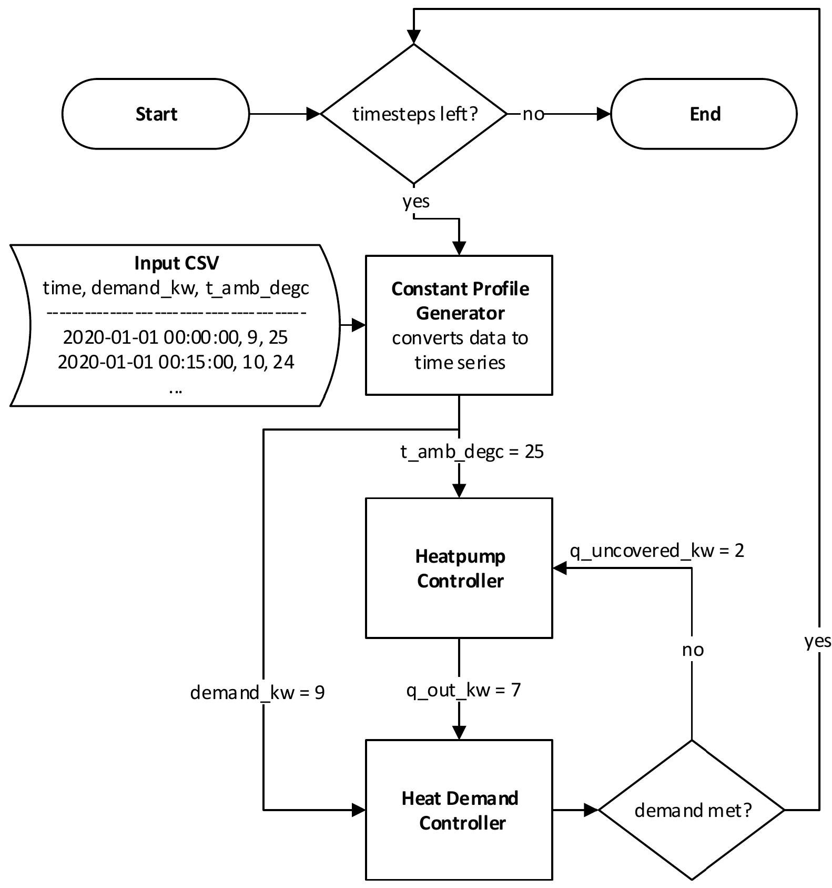

##########################
About pandaprosumer
##########################

pandaprosumer extends the libraries `pandapower <http://pandapower.org>`_ and `pandapipes <https:/pandapipes.org>`_ .

More information can be found on `www.pandaprosumer.org <https://www.pandaprosumer.org>`_.

Pandaprosumer is an open-source modeling tool, that enables modeling of sector-coupling prosumer components in energy systems.
The framework comes with a library of different predefined sector-coupling components, but also enables users to create
own components based on the pandaprosumer framework.
It also comes with a logic to simulate different combinations of these components with each other and different
inputs (e.g. a heat demand timeseries) and outputs (e.g. power load timeseries on the powergrid).

    Schematic representation of the pandaprosumer logic for a heat pump example

Installation
=====================

Through pip
------------
The easiest way to install pandaprosumer is through pip.

    Open a command prompt (e.g. start > cmd on windows systems)

    Install pandaprosumer by running::

     pip install pandaprosumer

Without pip
------------

If you don't have internet access on your system or don't want to use pip for some other reason, pandaprosumer can also
be installed without using pip:

    Download and unzip the current pandaprosumer distribution from PyPi under 'Download files'.

    Open a command prompt (e.g. start > cmd on windows systems) and navigate to the folder that contains the setup.py file with the command cd <folder> ::

        cd %path_to_pandaprosumer%\pandaprosumer-x.x.x\

    Install pandaprosumer by running::

        python setup.py install

Further Links
=============
- `Documentation <https://pandaprosumer.readthedocs.io/en/latest/>`_

- `Tutorials on github <https://github.com/e2nIEE/pandaprosumer/tree/master/tutorials>`_
