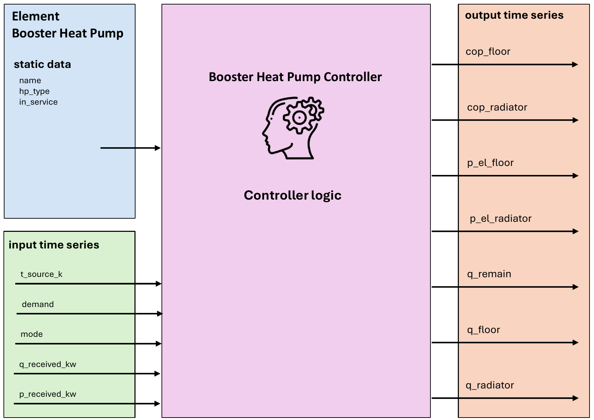

.. _booster_heat_pump_element:

==================
Booster Heat Pump
==================

.. seealso::
    :ref:`Unit Systems and Conventions <conventions>`

.. note::
    A booster heat pump consists of an element and a controller. The element defines it's physical parameters,
    while the controller governs the operational logic.

    The create_controlled function creates both and connects them.

Create Controlled Function
=============================

.. autofunction:: pandaprosumer.create_controlled_booster_heat_pump

Controller
===============================

.. raw:: html

    

Input Static Data
--------------------

.. csv-table::
    :header: "Parameter", "Description", "Unit"

    "name", "Custom name for the Booster heat pump", "N/A"
    "hp_type", "Type of heat pump", "N/A"
    "in_service", "Indicates if the Booster heat pump is in service", "N/A"

Input Time Series
-------------------

.. csv-table::
    :header: "Parameter", "Description", "Unit"

    "name", "Custom name for the Booster heat pump", "N/A"
    "hp_type", "Type of heat pump", "N/A"
    "in_service", "Indicates if the Booster heat pump is in service", "N/A"

Output Time Series
-------------------

.. csv-table::
    :header: "Parameter", "Description", "Unit"

    "cop_floor", "Coefficient of performance for floor heating", "N/A"
    "cop_radiator", "Coefficient of performance for radiator heating", "N/A"
    "p_el_floor", "Electrical power for floor heating", "kW"
    "p_el_radiator", "Electrical power for radiator heating", "kW"
    "q_remain", "Remaining heat power", "kW"
    "q_floor", "Heat power delivered to the floor", "kW"
    "q_radiator", "Heat power delivered to the radiator", "kW"

Mapping
-----------------------

The Booster Heat Pump model can be mapped using :ref:`GenericMapping <GenericMapping>`.

Model
=======

.. autoclass:: pandaprosumer.controller.models.BoosterHeatPumpController
    :members:

    The main inputs of the Booster Heat Pump (BHP) are a range of source temperatures :math:`T_s` and an operational mode. Creating a Booster Heat Pump element also requires specifying the type of heat pump to be used. Available options are air-to-water (``air-water`` with maximum source temperature of 318 K) and two types of water-to-water heat pumps (``water-water1``, with a maximum source temperature of 298 K, and ``water-water2``, with a maximum source temperature of 318 K). The water-to-water heat pumps also differ in their maximum available heat and the temperature dependency of the :math:`COP`.

Depending on the selected operational mode, different calculations are performed:

- **Mode 1** is used when the BHP receives electrical energy from a well-defined source, such as a CHP unit, and also receives heat from the same source. It is defined by the following equation:

  .. math::

     \dot{Q}_{out} = P_{in} \cdot COP + \dot{Q}_{in},

  where :math:`\dot{Q}_{out}` is the output heat, :math:`P_{in}` is the input electrical power, :math:`COP` is the coefficient of performance of the booster heat pump, and :math:`\dot{Q}_{in}` is the input heat.

- **Mode 2** is used when the BHP receives only electricity. It is defined by the equation:

  .. math::

     \dot{Q}_{out} = P_{in} \cdot COP.

- **Mode 3** assumes an infinite electrical source that provides electrical power, and the calculation is based on the following equation:

  .. math::

     P_{in} = \frac{\dot{Q}_{dem}}{COP},

  where :math:`\dot{Q}_{dem}` is the heat demand.

The calculation of :math:`COP` is based on the following expression:

.. math::

   COP = a_0 + a_1 \Delta T + a_2 \Delta T^2,

where :math:`a_0`, :math:`a_1`, and :math:`a_2` are predefined coefficients, and :math:`\Delta T` is the temperature difference between the source and the sink. Sink temperatures are calculated using heating curves.

The final important quantity is the **maximum available heat** that the booster heat pump can provide. It is calculated using the following equation:

.. math::

   \dot{Q}_{max} = c_1 + c_2 \cdot T_s,

where :math:`c_1` and :math:`c_2` are predefined coefficients.
