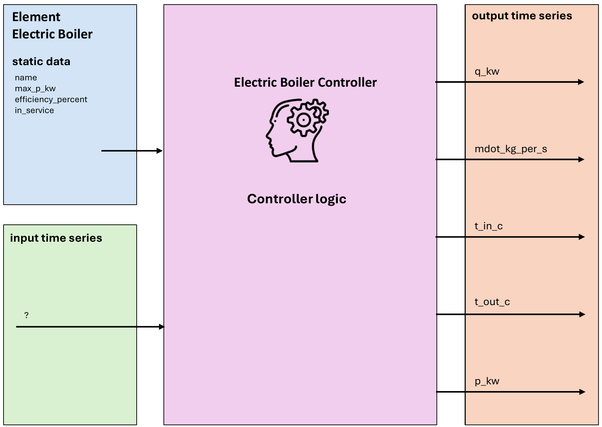

.. _electric_boiler_element:

==================
Electric Boiler
==================

.. seealso::
    :ref:`Unit Systems and Conventions <conventions>`

.. note::
    An electric boiler consists of one element and one controller.
    The element defines its physical parameters, while the controller governs the operational logic.

Create Controlled Function
===============================

.. autofunction:: pandaprosumer.create_controlled_electric_boiler

Controller
===============================

.. raw:: html

    

Input Static Data
----------------------------
These are the physical parameters required for the Electric Boiler element to enable the model calculation:

.. csv-table::
   :header: "Parameter", "Description", "Unit"

   "name", "Unique name or identifier for the electric boiler element.", "N/A"
   "max_p_kw", "Maximum electrical power of the boiler.", "kW"
   "min_p_kw", "Minimum electrical power of the boiler. Only relevant when allow_stop is False.", "kW"
   "max_ramp_up_kw_per_s", "Maximum allowed increase of electrical power between two time steps.", "kW/s"
   "max_ramp_down_kw_per_s", "Maximum allowed decrease of electrical power between two time steps.", "kW/s"
   "efficiency_percent", "Boiler efficiency expressed as a percentage.", "%"
   "allow_stop", "Whether the boiler is allowed to stop completely (reach zero power) when there is zero demand. If False and min_p_kw is set, the boiler will operate at min_p_kw even with zero demand.", "Boolean"
   "max_t_out_c", "Maximum output temperature constraint. If the calculated output temperature exceeds this value, it will be limited to this temperature.", "Degree Celsius"
   "overflow_strategy", "How to dispatch surplus mass flow to responders when the boiler runs at ``min_p_kw`` but the demand asks for less. ``'dump_proportional'`` (default) splits the surplus across responders in proportion to their requests; ``'dump_on_last'`` pushes the surplus mass flow onto the last responder at the requested feed temperature; ``'cap'`` drops the surplus and raises ``t_out_c`` to keep energy balance. See :ref:`overflow_strategy`.", "str"

Input Time Series
---------------------------------

No input (GenericMapping) needed for this controller

Output Time Series
----------------------------

.. csv-table:: Output Time Series: Electric Boiler

   :header: "Parameter", "Description", "Unit"
   "q_kw", "The provided heat power.", "kW"
   "mdot_kg_per_s", "The water mass flow rate through the boiler.", "kg/s"
   "t_in_c", "The temperature at the inlet of the electric boiler (cold return pipe).", "Degree Celsius"
   "t_out_c", "The temperature at the outlet of the electric boiler (hot feed pipe).", "Degree Celsius"
   "p_kw", "The boiler consumed electrical power.", "kW"

Mapping
-----------------------

The Electric Boiler Controller can be mapped using :ref:`FluidMixMapping <FluidMixMapping>`.

- No inputs are mapped, as the electric boiler does not act as a responder.
- The following outputs are mapped:

  - ``mdot_kg_per_s``
  - ``t_out_c``

Model
=======================

.. autoclass:: pandaprosumer.controller.models.ElectricBoilerController
    :members:

The electric boiler model calculate the power consumption of the boiler to heat up the fluid to the demand power.
It is a tankless electric water heater that heats water on demand.

.. math::
    :nowrap:

    \begin{align*}
        P_\text{el} = \frac{Q}{\eta} &= \frac{\dot{m} * Cp * (T_\text{feed} - T_\text{return})}{\eta}  \\
    \end{align*}

If the power consumption is higher than the maximum power of the boiler P_{\text{el}_\text{max}}, the power
consumption is set to the maximum power, and the actual output temperature  :math:`T_\text{feed}` that can
be reached is calculated based on the maximum power.

The model also supports additional constraints:

- **Maximum output temperature constraint**: If :math:`T_\text{feed}` exceeds the ``max_t_out_c`` parameter,
  the output temperature is limited to this maximum value and the mass flow is adjusted accordingly.

- **Minimum power constraint**: If ``min_p_kw`` is set, the boiler will maintain at least this minimum power
  level, regardless of the ``allow_stop`` setting. When the calculated power would be below ``min_p_kw``,
  the boiler operates at ``min_p_kw``. The ``allow_stop`` parameter only affects whether the boiler can
  shut down completely when there is zero demand - if ``allow_stop=False``, the boiler will operate at
  ``min_p_kw`` even with zero demand.

