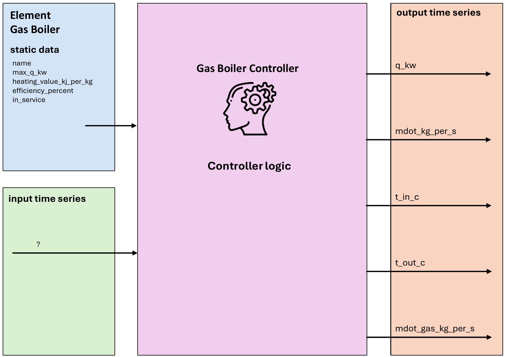

.. _gas_boiler_element:

==================
Gas Boiler
==================

.. seealso::
    :ref:`Unit Systems and Conventions <conventions>`

.. note::
    A gas boiler consists of one element and one controller.
    The element defines its physical parameters, while the controller governs the operational logic.

Create Controlled Function
=============================

.. autofunction:: pandaprosumer.create_controlled_gas_boiler

Controller
===============================

Input Static Data
----------------------------

These are the physical parameters required for the Gas Boiler element to enable the model calculation:

.. csv-table:: Input Static Data: Gas Boiler Element
   :header: "Parameter", "Description", "Unit"

   "name", "Unique name or identifier for the gas boiler element.", "N/A"
   "max_q_kw", "Maximum heat power of the boiler.", "kW"
   "efficiency_percent", "Boiler efficiency expressed as a percentage.", "%"

Input Time Series
----------------------------------

No input (GenericMapping) needed for this controller

Output Time Series
-----------------------------

.. csv-table:: Output Time Series: Gas Boiler
   :header: "Parameter", "Description", "Unit"

   "q_kw", "The provided heat power.", "kW"
   "mdot_kg_per_s", "The water mass flow rate through the boiler.", "kg/s"
   "t_in_c", "The temperature at the inlet of the gas boiler (cold return pipe).", "Degree Celsius"
   "t_out_c", "The temperature at the outlet of the gas boiler (hot feed pipe).", "Degree Celsius"
   "mdot_gas_kg_per_s", "The gas mass flow rate through the boiler", "kg/s"

Mapping
--------------------------

The Gas Boiler Controller can be mapped using :ref:`FluidMixMapping <FluidMixMapping>`.

- No inputs are mapped, as the gas boiler does not act as a responder.
- The following outputs are mapped:

  - ``mdot_kg_per_s``
  - ``t_out_c``

Model
=================

.. autoclass:: pandaprosumer.controller.models.GasBoilerController
    :members:

The gas boiler model calculate the thermal power produced of the boiler and the mass flow of the gas to heat up the fluid to the demand power.

.. math::
    :nowrap:

    \begin{align*}
        Q &= \dot{m} * Cp * (T_\text{feed} - T_\text{return})   \\
    \end{align*}

.. math::
        \dot{m}_\text{gas} = \frac{Q}{HV * \eta}

If the power consumption is higher than the maximum power of the boiler, the power
consumption is set to the maximum power, and the actual output temperature  :math:`T_\text{feed}` that can
be reached is calculated based on the maximum power.
For a gas boiler, the maximum power is defined as the maximum thermal power output, representing the highest amount of heat energy the boiler can produce.
