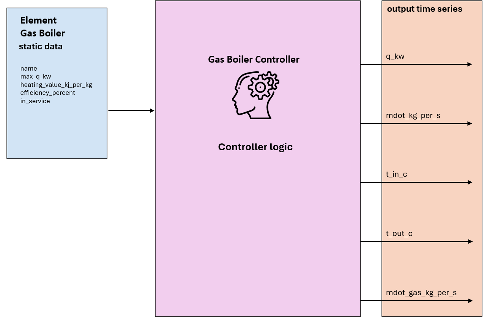

.. _gas_boiler_element:

==================
Gas Boiler
==================

.. seealso::
    :ref:`Unit Systems and Conventions <conventions>`

.. note::
    A gas boiler consists of one element and one controller.
    The element defines its physical parameters, while the controller governs the operational logic.

Create Controlled Function
=============================

.. autofunction:: pandaprosumer.create_controlled_gas_boiler

Controller
===============================

.. raw:: html

    

Input Static Data
----------------------------

These are the physical parameters required for the Gas Boiler element to enable the model calculation:

.. csv-table:: 
   :header: "Parameter", "Description", "Unit"

   "name", "Unique name or identifier for the gas boiler element.", "N/A"
   "max_q_kw", "Maximum heat power of the boiler.", "kW"
   "min_q_kw", "Minimum heat power of the boiler. If the requested thermal power is positive but below this value, the boiler runs at this minimum power.", "kW"
   "max_ramp_up_kw_per_s", "Maximum allowed increase of thermal power between two time steps.", "kW/s"
   "max_ramp_down_kw_per_s", "Maximum allowed decrease of thermal power between two time steps.", "kW/s"
   "heating_value_kj_per_kg", "Lower heating value of the fuel used by the boiler.", "kJ/kg"
   "efficiency_percent", "Boiler efficiency expressed as a percentage.", "%"
   "allow_stop", "Whether the boiler is allowed to stop completely (reach zero power). If False, the boiler maintains minimum power even when demand is null. See :ref:`gas_boiler_edge_cases` for important interaction with temperature constraints.", "Boolean"
   "max_t_out_c", "Maximum output temperature constraint. If set, limits the boiler's output temperature to this value. See :ref:`gas_boiler_edge_cases` for important interaction with minimum power constraints.", "Degree Celsius"
   "overflow_strategy", "How to dispatch surplus mass flow to responders when the boiler runs at ``min_q_kw`` but the demand asks for less. ``'dump_proportional'`` (default) splits the surplus across responders in proportion to their requests; ``'dump_on_last'`` pushes the surplus mass flow onto the last responder at the requested feed temperature; ``'cap'`` drops the surplus and raises ``t_out_c`` to keep energy balance. See :ref:`overflow_strategy`.", "str"

Input Time Series
----------------------------------

No input (GenericMapping) needed for this controller

Output Time Series
-----------------------------

.. csv-table::
   :header: "Parameter", "Description", "Unit"

   "q_kw", "The provided heat power.", "kW"
   "mdot_kg_per_s", "The water mass flow rate through the boiler.", "kg/s"
   "t_in_c", "The temperature at the inlet of the gas boiler (cold return pipe).", "Degree Celsius"
   "t_out_c", "The temperature at the outlet of the gas boiler (hot feed pipe).", "Degree Celsius"
   "mdot_gas_kg_per_s", "The gas mass flow rate through the boiler", "kg/s"

Mapping
--------------------------

The Gas Boiler Controller can be mapped using :ref:`FluidMixMapping <FluidMixMapping>`.

- No inputs are mapped, as the gas boiler does not act as a responder.
- The following outputs are mapped:

  - ``mdot_kg_per_s``
  - ``t_out_c``

Model
=================

.. autoclass:: pandaprosumer.controller.models.GasBoilerController
    :members:

The gas boiler model calculate the thermal power produced of the boiler and the mass flow of the gas to heat up the fluid to the demand power.

.. math::
    :nowrap:

    \begin{align*}
        Q &= \dot{m} * Cp * (T_\text{feed} - T_\text{return})   \\
    \end{align*}

.. math::
        \dot{m}_\text{gas} = \frac{Q}{HV * \eta}

If the power consumption is higher than the maximum power of the boiler, the power
consumption is set to the maximum power, and the actual output temperature  :math:`T_\text{feed}` that can
be reached is calculated based on the maximum power.
For a gas boiler, the maximum power is defined as the maximum thermal power output, representing the highest amount of heat energy the boiler can produce.

.. _gas_boiler_edge_cases:

Edge Cases and Constraint Interactions
========================================

The gas boiler model includes handling of edge cases, particularly the interaction between temperature constraints and minimum power requirements:

1. **Temperature Constraint with Minimum Power**
   
   When ``allow_stop=False`` and ``max_t_out_c`` constraint is defined, the boiler prioritizes maintaining minimum power over strict temperature limitation. The model:
   
   - First applies the temperature constraint to limit output temperature
   - Then checks if the resulting power would drop below ``min_q_kw``
   - If so, increases mass flow to maintain minimum power at the constrained temperature
   
   This ensures that the boiler never violates minimum power requirements, even when temperature constraints would normally reduce power below the minimum.

2. **Mass Flow Adjustment Mechanism**
   
   The boiler automatically adjusts mass flow in two scenarios:
   
   - **Temperature Constraint Activation**: When output temperature is limited by ``max_t_out_c``, mass flow is increased to maintain the requested power
   - **Minimum Power Enforcement**: When temperature constraints would cause power to drop below ``min_q_kw`` with ``allow_stop=False``, mass flow is further increased to achieve minimum power

3. **Physical Consistency Preservation**
   
   Throughout all constraint interactions, the model maintains:
   
   - **Energy Balance**: :math:`Q = \dot{m} * Cp * \Delta T`
   - **Power Limits**: Respects both ``max_q_kw`` and ``min_q_kw`` constraints
   - **Temperature Limits**: Never exceeds ``max_t_out_c`` when set
   - **Efficiency**: Maintains specified ``efficiency_percent`` in all operating conditions to calculate the corresponding amount of fuel

4. **Sequential Constraint Application**
   
   Constraints are applied in this order for robust behavior:
   
   1. Calculate initial power based on demand
   2. Apply ramp rate constraints (if applicable)
   3. Apply maximum temperature constraint
   4. Enforce minimum power constraint (if ``allow_stop=False``)
   5. Perform mass/energy balance adjustment
   6. Reapply temperature constraint after balance adjustment

Example Scenario
----------------

Consider a gas boiler with:

- ``min_q_kw = 20`` (minimum power)
- ``max_t_out_c = 70`` (maximum output temperature)
- ``allow_stop = False`` (the boiler cannot stop but should continuously run, so the power should remain >= min_q_kw)
- Demand: 0.05 kg/s mass flow at 80°C (which would require only 10.45 kW at constrained 70°C)

Results after Boiler model constraints application:

- Temperature is constrained to 70°C
- Power is maintained at 20 kW (minimum)
- Mass flow is increased to 0.0957 kg/s to achieve 20 kW at 70°C
- Result: ``q_kw = 20``, ``t_out_c = 70``, ``mdot_delivered = 0.0957``

This behavior ensures reliable operation while respecting all physical constraints.
