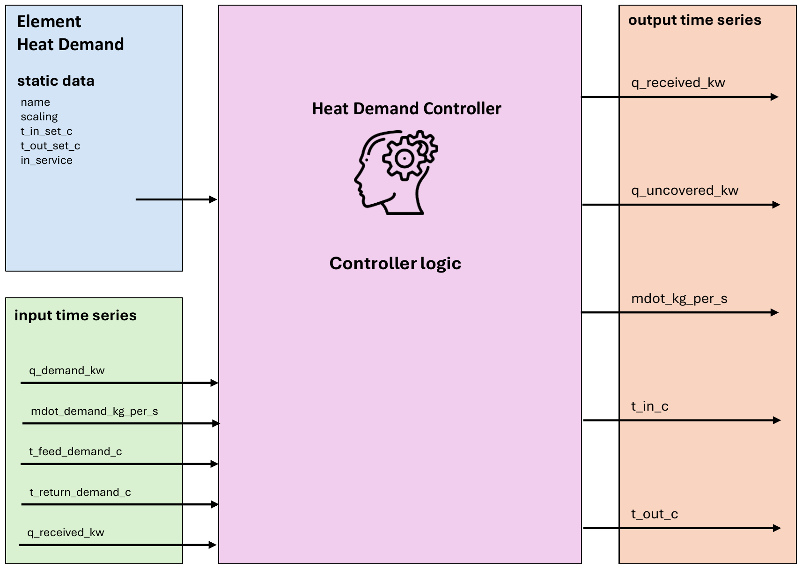

.. _heat_demand_element:

=======================
Heat Demand
=======================

.. seealso::
    :ref:`Unit Systems and Conventions <conventions>`

.. note::
    A heat demand consists of an element and a controller. The element defines it's physical parameters,
    while the controller governs the operational logic.

    The create_controlled function creates both and connects them.

Create Controlled Function
============================

.. autofunction:: pandaprosumer.create_controlled_heat_demand

Controller
=======================

Input Static Data
-------------------------

.. csv-table:: Input Static Data: Heat Demand Element
   :header: "Parameter", "Description", "Unit"

   "name", "Unique name or identifier for the gas boiler element.", "N/A"
   "q_demand_kw", "Demand heat power", "kW"
   "mdot_demand_kg_per_s", "Demand required mass flow", "kg/s"
    "t_feed_demand_c ", "Demand required feed temperature level", "Degree Celsius"
    "t_return_demand_c ", "Demand required return temperature level", "Degree Celsius"

Input Time Series
-------------------

.. csv-table::
    :header: "Parameter", "Description", "Unit"

    "q_demand_kw ", "Demand heat power ", "kW"
    "mdot_demand_kg_per_s  ", "Demand required mass flow", "kg/s"
    "t_feed_demand_c", "Demand required feed temperature level", "Degree Celsius"
    "t_return_demand_c", "Demand required return temperature level", "Degree Celsius"

Output Time Series
-------------------

.. csv-table::
    :header: "Parameter", "Description", "Unit"

    "q_uncovered_kw", "Uncovered heat power. Can be negative if the power provided is greater than the required power", "kW"

Mapping
----------------

The Heat Demand Controller can be mapped using :ref:`FluidMixMapping <FluidMixMapping>`.

- The heat demand can be used as responder for a FluidMix mapping, taking the output from another controller as its input

- The heat demand can also be used as responder for a Generic mapping, in this case the results from another controller are mapped to the following inputs of the heat demand:

  - ``q_received_kw``

- No output are mapped, as the heat demand does not act as an initiator.

   
Model
=================

.. autofunction:: pandaprosumer.controller.models.HeatDemandController

The heat demand model take four inputs :math:`Q`, :math:`\dot{m}`, :math:`T_\text{feed}` and :math:`T_\text{return}`

Only three of these inputs should be provided, typically from timeseries data through a
:ref:`ConstProfile controller <const_profile_controller>`. The fourth one will be inferred from the relation

.. math::
    :nowrap:

    \begin{align*}
        Q = \dot{m} * Cp * (T_\text{feed} - T_\text{return})
    \end{align*}

