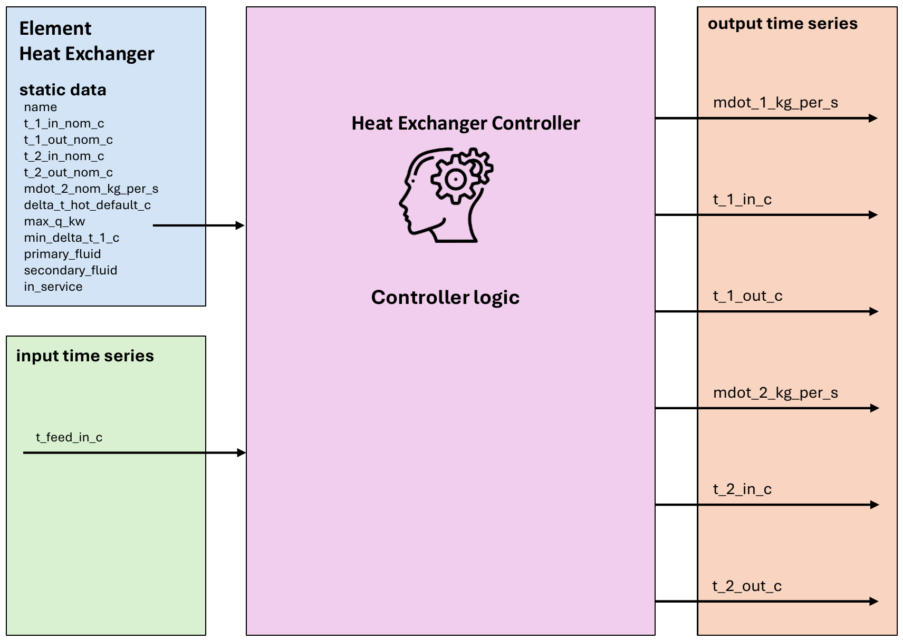
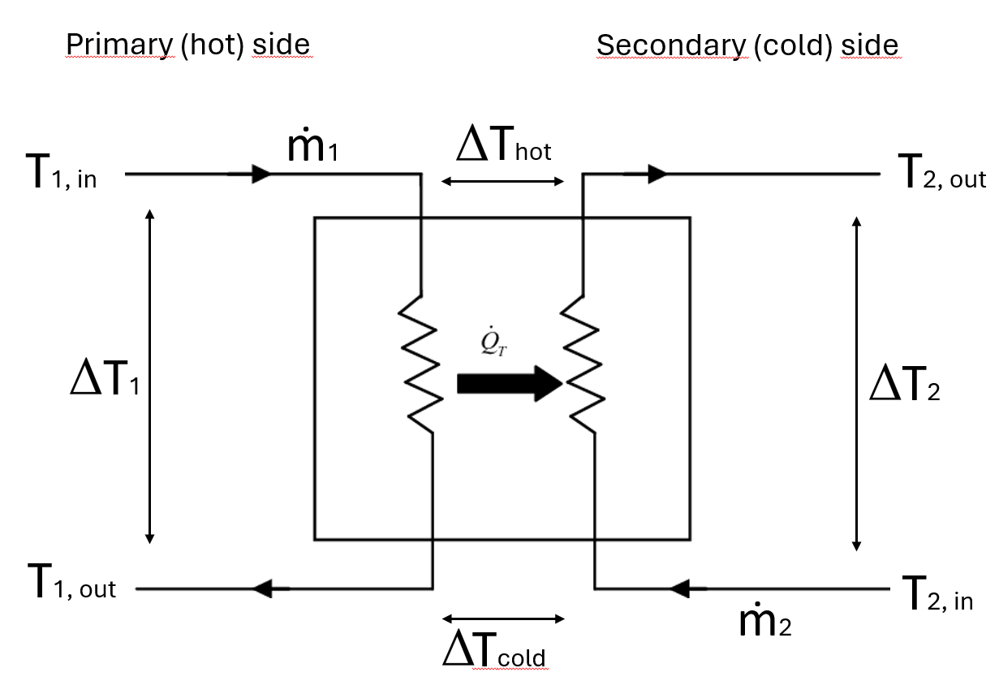
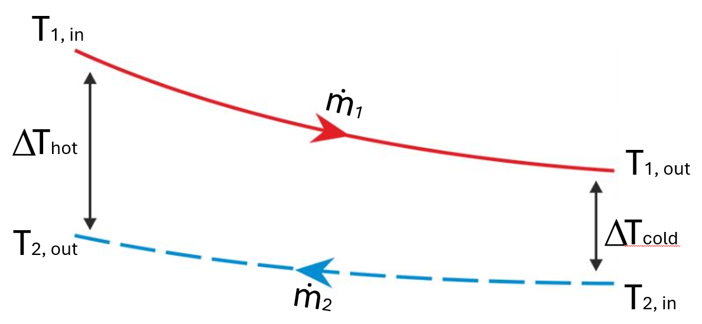

.. _heat_exchanger_element:

===============
Heat Exchanger
===============

.. seealso::
    :ref:`Unit Systems and Conventions <conventions>`

.. note::
    A heat exchanger consists of an element and a controller. The element defines it's physical parameters,
    while the controller governs the operational logic.

    The create_controlled function creates both and connects them.

Create Controlled Function
============================

.. autofunction:: pandaprosumer.create_controlled_heat_exchanger

Controller
==========================

.. raw:: html

    

Input Static Data
------------------------
These are the physical parameters required for the Heat Exchanger element to enable the model calculation:

.. csv-table:: 
   :header: "Parameter", "Description", "Unit"

   "name", "Unique name or identifier for the Heat Exchanger element.", "N/A"
   "t_1_in_nom_c", "Primary nominal input temperature", "Degree Celsius"
   "t_1_out_nom_c", "Primary nominal output temperature", "Degree Celsius"
   "t_2_in_nom_c", "Secondary nominal input temperature", "Degree Celsius"
   "t_2_out_nom_c", "Secondary nominal output temperature", "Degree Celsius"
   "mdot_2_nom_kg_per_s", "Secondary nominal mass flow", "kg/s"
   "delta_t_hot_default_c", "Default difference between the hot (feed) temperatures", "Degree Celsius"
   "max_q_kw", "Maximum heat power through the heat exchanger", "kW"
   "min_delta_t_1_c", "Minimum temperature difference at the primary side", "Degree Celsius"
   "primary_fluid", "Fluid at the primary side of the heat exchanger. If None, the prosumer’s fluid will be used", "N/A"
   "secondary_fluid", "Fluid at the secondary side of the heat exchanger. If None, the prosumer’s fluid will be used", "N/A"

Input Time Series
---------------------------

.. csv-table:: Input Time Series: Heat Exchanger
   :header: "Parameter", "Description", "Unit", "Datatype"

   "t_feed_in_c", "The feed temperature at the primary side (e.g. from the heating network). Only read when the primary side is not fed by a FluidMix mapping", "Degree Celsius", "float"

Output Time Series
---------------------------

.. csv-table:: Output Time Series: Heat Exchanger
   :header: "Parameter", "Description", "Unit"

   "q_exchanged_kw", "Exchanged heat power, booked on the primary side: :math:`\dot{m}_1 Cp_1 (T_{1_\text{in}} - T_{1_\text{out}})`", "kW"
   "mdot_1_kg_per_s", "The mass flow rate at the primary side of the heat exchanger", "kg/s"
   "t_1_in_c", "The feed input temperature at the primary side of the heat exchanger", "Degree Celsius"
   "t_1_out_c", "The return output temperature at the primary side of the heat exchanger", "Degree Celsius"
   "mdot_2_kg_per_s", "The mass flow rate at the secondary side of the heat exchanger", "kg/s"
   "t_2_in_c", "The return input temperature at the secondary side of the heat exchanger", "Degree Celsius"
   "t_2_out_c", "The feed output temperature at the secondary side of the heat exchanger", "Degree Celsius"

Mapping
----------------
The Heat Exchanger Controller can be mapped using :ref:`FluidMixMapping <FluidMixMapping>`.

- As **responder**, the heat exchanger receives the primary feed (``t_1_in_c`` and, optionally, a fixed
  primary mass flow) from an upstream controller. When no FluidMix feeds the primary side, ``t_1_in_c`` is
  read from the ``t_feed_in_c`` input time series and the primary mass flow is free (computed by the model).

- As **initiator**, the heat exchanger delivers its secondary side to the downstream controllers (heat
  demand, storage, ...). The following outputs are mapped:

  - ``mdot_2_kg_per_s``
  - ``t_2_out_c``

  The downstream demand contract (``t_m_to_deliver``: required feed temperature, return temperature and
  mass flow per responder) drives the calculation, see :ref:`heat_exchanger_regimes` below. With several
  responders the secondary mass flow is distributed in merit order.

- ``t_m_to_receive`` (what the heat exchanger asks from its own upstream) returns, for a given primary feed
  temperature, the primary mass flow and return temperature computed by the same model. Before the first
  time step it assumes a primary feed at ``t_feed_demand_c + delta_t_hot_default_c``; afterwards it
  returns the previous step's primary state.

Model
=================

.. autoclass:: pandaprosumer.controller.models.HeatExchangerController
    :members:

Model of a simple heat exchanger based on logarithmic mean temperature difference (LMTD) calculation
with countercurrent flows.

The primary side of the heat exchanger should be the hot side get heat from a District Heating Network.

The secondary side should be the cold connected to downstream elements in the prosumer.

The model is based on a nominal state for which all the temperatures and mass flows
:math:`T_{1_{\text{in}_n}}`, :math:`T_{1_{\text{out}_n}}`, :math:`T_{2_{\text{in}_n}}`, :math:`T_{2_{\text{out}_n}}`
and :math:`\dot{m}_{2_n}` are known.

Then given :math:`\dot{m}_2`, :math:`T_{2_\text{in}}`, :math:`T_{2_\text{out}}` and :math:`T_{1_\text{in}}` for
another state, the model can calculate :math:`T_{1_\text{out}}` and :math:`\dot{m}_1`.

    Schematic representation of a heat exchanger considered by EIFER during modeling

    The LMTD illustrated in a countercurrent temperature profile

The logarithmic mean temperature difference (LMTD) is defined as

.. math::
    :nowrap:

    \begin{align*}
        \text{LMTD} &= \frac{\Delta T_\text{hot} - \Delta T_\text{cold}}{\ln{\Delta T_\text{hot}} - \ln{\Delta T_\text{cold}}}  \\
    \end{align*}

The LMTD can be used to find the exchanged heat in the heat exchanger:

.. math::
    :nowrap:

    \begin{align*}
        Q &= Q_1 &= Q_2 &= UA * LMTD  \\
        Q_n &= Q_{1_n} &= Q_{2_n} &= UA * LMTD_n  \\
    \end{align*}

So

.. math::
    :nowrap:

    \begin{align*}
        \frac{LMTD}{LMTD_n} &= \frac{Q}{Q_n}   \\
    \end{align*}

From that we derive:

.. math::
    :nowrap:

    \begin{align*}
        a * X + \ln{(1-X)} &= 0  \\
    \end{align*}

With

.. math::
    :nowrap:

    \begin{align*}
        a &= \Delta T_\text{hot} * \frac{Q_{2_n}}{Q_2} * \frac{1}{LMTD_n}  \\
        X &= 1 - \frac{\Delta T_\text{cold}}{\Delta T_\text{hot}}
    \end{align*}

This equation is solved by dichotomy to find :math:`X`, then :math:`\Delta T_\text{cold}`,
then :math:`T_{1_\text{out}}`.

Assuming no heat losses, we then derive :math:`\dot{m}_1` given that

.. math::
    :nowrap:

    \begin{align*}
        Q = Q_1 = Q_2 = \dot{m}_1 * Cp_1 * \Delta T_1 = \dot{m}_2 * Cp_2 * \Delta T_2
    \end{align*}

.. note::
    :math:`a = 1` means that :math:`X = 0` so :math:`\Delta T_\text{cold} = \Delta T_\text{hot}`
    (it corresponds to a limit case where the LMTD is not defined)

    :math:`0 < a < 1` means that :math:`X < 0` so :math:`\Delta T_\text{cold} > \Delta T_\text{hot}`

    :math:`a > 1` means that :math:`0 < X < 1` so :math:`\Delta T_\text{cold} < \Delta T_\text{hot}`

    :math:`a \to \infty` means that :math:`X \to 1` so :math:`\Delta T_\text{cold} \to 0`: the exchanger is
    far oversized for the requested duty (:math:`Q_2 \ll Q_{2_n}`) and the primary outlet pinches on the
    secondary inlet, :math:`T_{1_\text{out}} \to T_{2_\text{in}}`.

.. note::
    :math:`X > 1` would mean :math:`\Delta T_\text{cold} < 0`, so :math:`T_{1_\text{out}} < T_{2_\text{in}}`,
    which is not possible for the heat exchange

    :math:`a << 1` would mean :math:`\Delta T_\text{cold} >> \Delta T_\text{hot}`,
    so :math:`T_{1_\text{out}} > T_{1_\text{in}}` which is not possible for a countercurrent flows

.. _heat_exchanger_regimes:

Operating regimes and limits
-----------------------------

The calculation is driven by the downstream demand contract :math:`(T_{2_\text{out}}, T_{2_\text{in}}, \dot{m}_2)`
and the primary feed temperature :math:`T_{1_\text{in}}`. The following cases are handled, in this order.

**No demand.** If :math:`\dot{m}_2 < 10^{-6}` kg/s or :math:`|T_{2_\text{out}} - T_{2_\text{in}}| < 10^{-3}` K,
no heat is exchanged: :math:`T_{1_\text{out}} = T_{1_\text{in}}` and :math:`\dot{m}_1 = 0`. If a primary
mass flow is nevertheless provided by an upstream FluidMix, it is passed through unchanged (full bypass).

**Demand contract shift.** If the requested secondary feed :math:`T_{2_\text{out}}` is above the primary feed
:math:`T_{1_\text{in}}` (unreachable), it is lowered to :math:`T_{1_\text{in}} - \min(\Delta T_{\text{hot}_\text{default}}, 5)`
and the return :math:`T_{2_\text{in}}` is lowered by the same amount, so the requested :math:`\Delta T_2` is kept.

**Maximum power.** If :math:`Q_2 = \dot{m}_2 Cp_2 \Delta T_2` is greater than the maximum power of the heat
exchanger :math:`Q_{\text{max}}` (``max_q_kw``), the secondary mass flow :math:`\dot{m}_2` is set to
:math:`\frac{Q_{\text{max}}}{Cp_2 \Delta T_2}` so the transferred power is equal to the maximum power before
solving for :math:`T_{1_\text{out}}`.

**No hot approach** (:math:`\Delta T_\text{hot} = T_{1_\text{in}} - T_{2_\text{out}} \le 0`). The LMTD
solution is evaluated directly with the generic ``compute_temp`` routine; it returns
:math:`T_{1_\text{out}} = T_{1_\text{in}}` and :math:`\dot{m}_1 = 0` (no exchange) whenever the result
would require the primary to warm up.

**Minimum primary temperature difference** (``min_delta_t_1_c``). The primary outlet cannot be colder than
:math:`T_{1_{\text{out}_\text{max}}} = T_{1_\text{in}} - \Delta T_{1_\text{min}}`, which gives a minimum value of
the parameter :math:`a`:
:math:`a_\text{min} = -\frac{\ln(1-x_\text{min})}{x_\text{min}}` with
:math:`x_\text{min} = 1 - \frac{T_{1_{\text{out}_\text{max}}} - T_{2_\text{in}}}{\Delta T_\text{hot}}`.
If :math:`a < a_\text{min}` (the requested power is too large for the available temperature difference),
the secondary mass flow :math:`\dot{m}_2` is reduced so that
:math:`Q_2 = Q_{2_n} * \frac{\Delta T_\text{hot}}{a_\text{min} * LMTD_n}`, and :math:`T_{1_{\text{out}}}` is set
to :math:`T_{1_{\text{out}_\text{max}}}`.

**Secondary return warmer than the allowed primary outlet** (:math:`x_\text{min} \ge 1`, i.e.
:math:`T_{2_\text{in}} \ge T_{1_{\text{out}_\text{max}}}`). ``min_delta_t_1_c`` is ignored and a fixed minimum
cold approach :math:`\Delta T_{\text{cold}_\text{min}} = 3` K is used instead:
:math:`T_{1_\text{out}} = T_{2_\text{in}} + \Delta T_{\text{cold}_\text{min}}`, and the exchanged power is the
one this approach allows. If even that approach is infeasible — :math:`T_{2_\text{in}} + \Delta T_{\text{cold}_\text{min}} > T_{1_\text{in}}`
or :math:`\Delta T_\text{hot} \le \Delta T_{\text{cold}_\text{min}}` — the exchanger **stalls**: no flow and no
exchange on either side (:math:`\dot{m}_1 = \dot{m}_2 = 0`, both outlets equal to their inlets). These
regimes occur on off-to-on transients of coupled simulations where the secondary cold side is still warm.

**Far below nominal duty** (:math:`a > a_\text{max}`, with :math:`a_\text{max} =` ``HeatExchangerControl.OUT_OF_RANGE_THRESHOLD`` :math:`= 36.5`).
The dichotomy solves :math:`1 - X = e^{-a}`, which falls below double precision for :math:`a \gtrsim 36`
(:math:`e^{-36.5} \approx 10^{-16}`), so the equation cannot be solved numerically. Its limit is well defined
though: the exchanger behaves as infinitely large for the requested duty and the primary outlet pinches on
the secondary inlet, :math:`\Delta T_\text{cold} = 0`, :math:`T_{1_\text{out}} = T_{2_\text{in}}`, with
:math:`\dot{m}_1 = \frac{Q_2}{Cp_1 (T_{1_\text{in}} - T_{2_\text{in}})}`. This is the same answer the dichotomy
returns for :math:`a` between about 23 and 36. This regime is reached as soon as the requested duty is a few
percent of the nominal one (e.g. a 4 MW exchanger asked for 250 kW with a large :math:`\Delta T_\text{hot}`),
so oversized exchangers driven by a small demand spend most of their time in it.

.. note::
    Until this limit was implemented, the model gave up in this regime and zeroed the primary side
    (:math:`T_{1_\text{out}} = T_{1_\text{in}}`, :math:`\dot{m}_1 = 0`) while the secondary result was still
    delivered downstream: the responder booked :math:`\dot{m}_2 Cp_2 \Delta T_2` while the exchanger booked
    :math:`Q = 0`, i.e. energy was created at the exchanger boundary. The regression test
    ``tests/models/test_heat_exchanger_oversized.py`` pins the current behaviour.

**Energy conservation at the boundary.** After these calculations, if :math:`\dot{m}_1 = 0`, the secondary
mass flow :math:`\dot{m}_2` is set to 0 and the secondary output temperature :math:`T_{2_\text{out}}` is set to
:math:`T_{2_\text{in}}`, so no heat can reach the downstream elements that the primary side did not deliver.
The reverse calculation applies the symmetric rule (:math:`\dot{m}_2 = 0 \Rightarrow \dot{m}_1 = 0`).

**Fixed primary mass flow.** When the primary side is fed by a FluidMix mapping, the upstream mass flow
:math:`\dot{m}_{1_\text{provided}}` is imposed:

- if the model requires more than is provided (:math:`\dot{m}_1 > \dot{m}_{1_\text{provided}}`), the
  calculation is inverted (``calculate_heat_exchanger_reverse``): the primary state
  :math:`(T_{1_\text{in}}, T_{1_\text{out}}, \dot{m}_{1_\text{provided}})` is taken as given, the same LMTD
  equation is solved for the secondary outlet :math:`T_{2_\text{out}}`, and :math:`\dot{m}_2` is deduced from
  the energy balance — the heat delivered downstream is reduced accordingly;
- if the model requires less than is provided, the extra primary flow bypasses the exchanger without
  exchanging heat and the primary outlet is the mixing temperature
  :math:`T_{1_\text{out}} = \frac{\dot{m}_\text{bypass} T_{1_\text{in}} + \dot{m}_1 T_{1_\text{out}}}{\dot{m}_{1_\text{provided}}}`,
  with :math:`\dot{m}_1 = \dot{m}_{1_\text{provided}}`.

**Several downstream responders.** The secondary mass flow is distributed in merit order. If the exchanger
cannot deliver the whole requested mass flow, the secondary return temperature is recomputed as the
mass-flow-weighted mean of the responders' return temperatures and, if it moved by more than 1 K, the
calculation is rerun with the new return (at most ``MAX_RERUN`` = 20 times). If the delivered mass flow
exceeds the requested one, the surplus is spread evenly over the responders.

**Numerical safeguards.** :math:`T_{1_\text{out}}` is snapped to :math:`T_{1_\text{in}}` when float rounding
pushes it less than :math:`10^{-9}` K above it; a larger overshoot, a negative mass flow or a NaN raise a
``ValueError`` naming the exchanger and the time step. The dichotomy stops at
``HeatExchangerControl.DICHOTOMY_CONVERGENCE_THRESHOLD`` :math:`= 10^{-12}` or after 300 iterations (with a warning).

Numerical constants
--------------------

.. csv-table::
   :header: "Constant (``pandaprosumer.constants.HeatExchangerControl``)", "Value", "Role"

   "OUT_OF_RANGE_THRESHOLD", "36.5", "Value of :math:`a` above which the pinch limit :math:`T_{1_\text{out}} = T_{2_\text{in}}` replaces the dichotomy"
   "DICHOTOMY_CONVERGENCE_THRESHOLD", "1e-12", "Convergence threshold of the dichotomy on :math:`X`"
   "MIN_PRIMARY_MASS_FLOW_KG_PER_S", "0.0556 (0.2 m3/h)", "Historical minimum primary flow; not used by the current model"

Logging
--------

The model logs through ``logging.getLogger("pandaprosumer.library.heat_exchanger_utils")`` and
``logging.getLogger("pandaprosumer.controller.models.heat_exchanger")`` (``DEBUG`` for the pinch regime,
``WARNING`` for a non-converged dichotomy). Applications must attach a handler to the ``pandaprosumer``
logger to see them.
