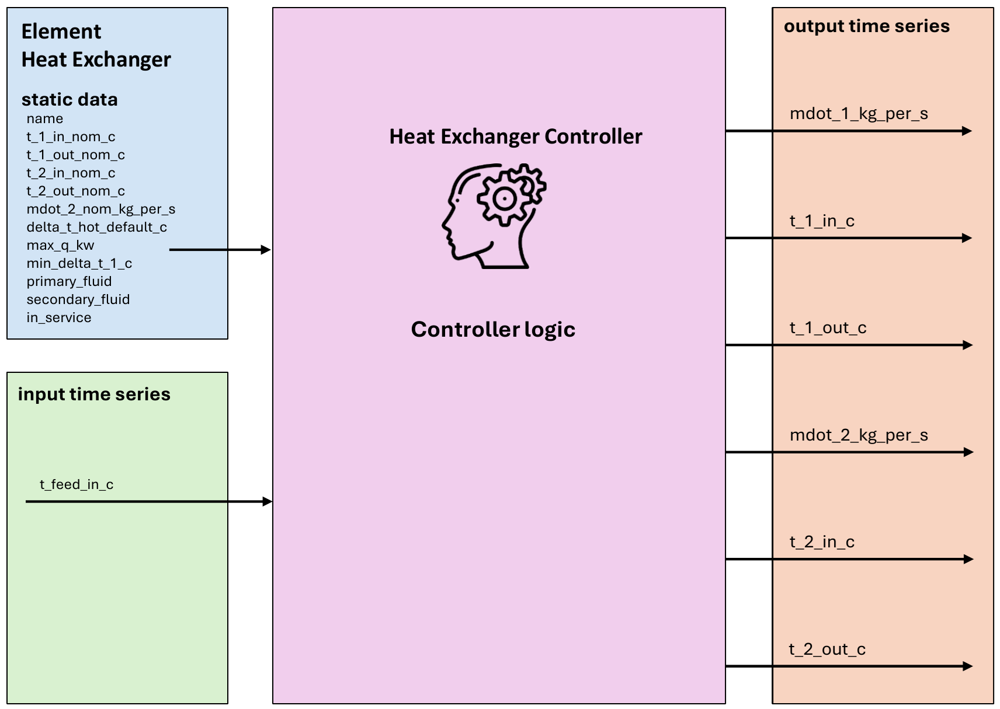
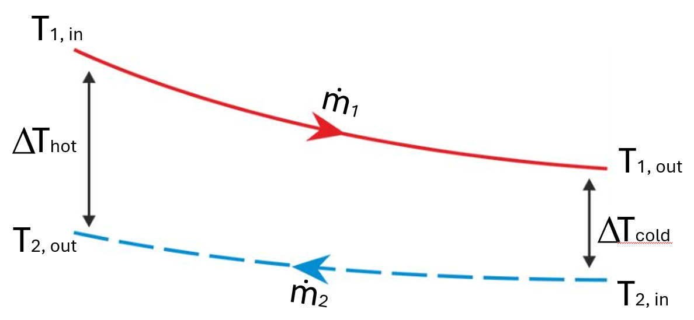

.. _heat_exchanger_element:

===============
Heat Exchanger
===============

.. seealso::
    :ref:`Unit Systems and Conventions <conventions>`

.. note::
    A heat exchanger consists of an element and a controller. The element defines it's physical parameters,
    while the controller governs the operational logic.

    The create_controlled function creates both and connects them.

Create Controlled Function
============================

.. autofunction:: pandaprosumer.create_controlled_heat_exchanger

Controller
==========================

Input Static Data
------------------------
These are the physical parameters required for the Heat Exchanger element to enable the model calculation:

.. csv-table:: Input Static Data: Heat Exchanger Element
   :header: "Parameter", "Description", "Unit"

   "name", "Unique name or identifier for the Heat Exchanger element.", "N/A"
   "t_1_in_nom_c", "Primary nominal input temperature", "Degree Celsius"
   "t_1_out_nom_c", "Primary nominal output temperature", "Degree Celsius"
   "t_2_in_nom_c", "Secondary nominal input temperature", "Degree Celsius"
   "t_2_out_nom_c", "Secondary nominal output temperature", "Degree Celsius"
   "mdot_2_nom_kg_per_s", "Secondary nominal mass flow", "kg/s"
   "delta_t_hot_default_c", "Default difference between the hot (feed) temperatures", "Degree Celsius"
   "max_q_kw", "Maximum heat power through the heat exchanger", "kW"
   "min_delta_t_1_c", "Minimum temperature difference at the primary side", "Degree Celsius"
   "primary_fluid", "Fluid at the primary side of the heat exchanger. If None, the prosumer’s fluid will be used", "N/A"
   "secondary_fluid", "Fluid at the secondary side of the heat exchanger. If None, the prosumer’s fluid will be used", "N/A"

Input Time Series
---------------------------

.. csv-table:: Input Time Series: Heat Exchanger
   :header: "Parameter", "Description", "Unit", "Datatype"

  "t_feed_in_c ", "The feed temperature from the heating network", "Degree Celsius"

Output Time Series
---------------------------

.. csv-table:: Output Time Series: Heat Exchanger
   :header: "Parameter", "Description", "Unit"

   "mdot_1_kg_per_s ", "The mass flow rate at the primary side of the heat exchanger", "kg/s"
   "t_1_in_c ", "The feed input temperature at the primary side of the heat exchanger", "Degree Celsius"
   "t_1_out_c ", "The return output temperature at the primary side of the heat exchanger", "Degree Celsius"
   "mdot_2_kg_per_s ", "The mass flow rate at the secondary side of the heat exchanger", "kW"
   "t_2_in_c ", "The return input temperature at the secondary side of the heat exchanger ", "Degree Celsius"
   "t_2_out_c ", "The feed output temperature at the secondary side of the heat exchanger", "Degree Celsius"

Mapping
----------------
The Heat Exchanger Controller can be mapped using :ref:`FluidMixMapping <FluidMixMapping>`.

- The heat exchanger can be used as responder for a FluidMix mapping, taking the output from another controller as its input

- The following outputs are mapped:

  - ``mdot_2_kg_per_s``
  - ``t_2_out_c``

Model
=================

.. autoclass:: pandaprosumer.controller.models.HeatExchangerController
    :members:

Model of a simple heat exchanger based on logarithmic mean temperature difference (LMTD) calculation
with countercurrent flows.

The primary side of the heat exchanger should be the hot side get heat from a District Heating Network.

The secondary side should be the cold connected to downstream elements in the prosumer.

The model is based on a nominal state for which all the temperatures and mass flows
:math:`T_{1_{\text{in}_n}}`, :math:`T_{1_{\text{out}_n}}`, :math:`T_{2_{\text{in}_n}}`, :math:`T_{2_{\text{out}_n}}`
and :math:`\dot{m}_{2_n}` are known.

Then given :math:`\dot{m}_2`, :math:`T_{2_\text{in}}`, :math:`T_{2_\text{out}}` and :math:`T_{1_\text{in}}` for
another state, the model can calculate :math:`T_{1_\text{out}}` and :math:`\dot{m}_1`.

.. figure:: heat_exchanger.png
    :width: 30em
    :alt: Schematic representation of a heat exchanger
    :align: center

    Schematic representation of a heat exchanger considered by EIFER during modeling

    The LMTD illustrated in a countercurrent temperature profile

The logarithmic mean temperature difference (LMTD) is defined as

.. math::
    :nowrap:

    \begin{align*}
        \text{LMTD} &= \frac{\Delta T_\text{hot} - \Delta T_\text{cold}}{\ln{\Delta T_\text{hot}} - \ln{\Delta T_\text{cold}}}  \\
    \end{align*}

The LMTD can be used to find the exchanged heat in the heat exchanger:

.. math::
    :nowrap:

    \begin{align*}
        Q &= Q_1 &= Q_2 &= UA * LMTD  \\
        Q_n &= Q_{1_n} &= Q_{2_n} &= UA * LMTD_n  \\
    \end{align*}

So

.. math::
    :nowrap:

    \begin{align*}
        \frac{LMTD}{LMTD_n} &= \frac{Q}{Q_n}   \\
    \end{align*}

From that we derive:

.. math::
    :nowrap:

    \begin{align*}
        a * X + \ln{(1-X)} &= 0  \\
    \end{align*}

With

.. math::
    :nowrap:

    \begin{align*}
        a &= \Delta T_\text{hot} * \frac{Q_{2_n}}{Q_2} * \frac{1}{LMTD_n}  \\
        X &= 1 - \frac{\Delta T_\text{cold}}{\Delta T_\text{hot}}
    \end{align*}

This equation is solved by dichotomy to find :math:`X`, then :math:`\Delta T_\text{cold}`,
then :math:`T_{1_\text{out}}`.

Assuming no heat losses, we then derive :math:`\dot{m}_1` given that

.. math::
    :nowrap:

    \begin{align*}
        Q = Q_1 = Q_2 = \dot{m}_1 * Cp_1 * \Delta T_1 = \dot{m}_2 * Cp_2 * \Delta T_2
    \end{align*}

.. note::
    :math:`a = 1` means that :math:`X = 0` so :math:`\Delta T_\text{cold} = \Delta T_\text{hot}`
    (it corresponds to a limit case where the LMTD is not defined)

    :math:`0 < a < 1` means that :math:`X < 0` so :math:`\Delta T_\text{cold} > \Delta T_\text{hot}`

    :math:`a > 1` means that :math:`0 < X < 1` so :math:`\Delta T_\text{cold} < \Delta T_\text{hot}`

.. note::
    :math:`X > 1` would mean :math:`\Delta T_\text{cold} < 0`, so :math:`T_{1_\text{out}} < T_{2_\text{in}}`,
    which is not possible for the heat exchange

    :math:`a << 1` would mean :math:`\Delta T_\text{cold} >> \Delta T_\text{hot}`,
    so :math:`T_{1_\text{out}} > T_{1_\text{in}}` which is not possible for a countercurrent flows

If the calculated :math:`T_{1_\text{out}}` is geater than the input primary temperature :math:`T_{1_\text{in}}`,
then :math:`T_{1_\text{out}}` is set to :math:`T_{1_\text{in}}` and the mass flow :math:`\dot{m}_1` is set to 0.

If :math:`a = 0`, then the mass flow :math:`\dot{m}_1` is set to a small value of 0.2 m3/h.

If the transferred power is greater than the maximum power of the heat exchanger :math:`Q_{\text{max}}`, 
the secondary mass flow :math:`\dot{m}_2` is set to :math:`\frac{Q_{\text{max}}}{Cp_2 \Delta T_2}` so the 
transferred power is equal to the maximum power before solving for :math:`T_{1_\text{out}}`.

A minimum value of the parameter :math:`a`, :math:`a_\text{min}` is calculated from the maximum cold temperature that can be reached at the outlet 
of the primary side :math:`T_{1_{\text{out}_\text{max}}}`.
:math:`a_\text{min} = -\frac{ln(1-x_\text{min})}{x_\text{min}}` with :math:`x_\text{min} = 1 - \frac{\Delta T_{\text{cold}_\text{max}}}{\Delta T_\text{hot}}`.
If :math:`a < a_\text{min}`, the secondary mass flow :math:`\dot{m}_2` is set so that 
:math:`Q_r = Q_{r_n} * \frac{\Delta T_\text{hot}}{a_\text{min} * LMTD_n}`, and :math:`T_{1_{\text{out}}}` is set to :math:`T_{1_{\text{out}_\text{max}}}`

If  :math:`a > a_\text{max}`, the temperature difference between the primary and secondary side :math:`\Delta T_\text{hot}` 
may be too high or the transferred heat :math:`Q_r` too small compared to the nominal conditions. 
In this case the dichotomy cannot be solve with sufficient precision and no heat 
exchange is assumed, setting :math:`T_{1_\text{out}} = T_{1_\text{in}}` and :math:`\dot{m}_1 = 0`.

After this calculations, if :math:`\dot{m}_1 = 0`, the secondary mass flow :math:`\dot{m}_2` is set to 0
and the secondary output temperature :math:`T_{2_\text{out}}` is set to :math:`T_{2_\text{in}}`.

If the calculated primary mass flow :math:`\dot{m}_1` is greater than the maximum mass flow available :math:`\dot{m}_{1_\text{max}}`,
then the secondary mass flow :math:`\dot{m}_2` is set so that 
:math:`Q_r = \dot{m}_{1_\text{max}} * Cp_1 * \Delta T_1`, considering the same :math:`\Delta T_1` as first calculated.
