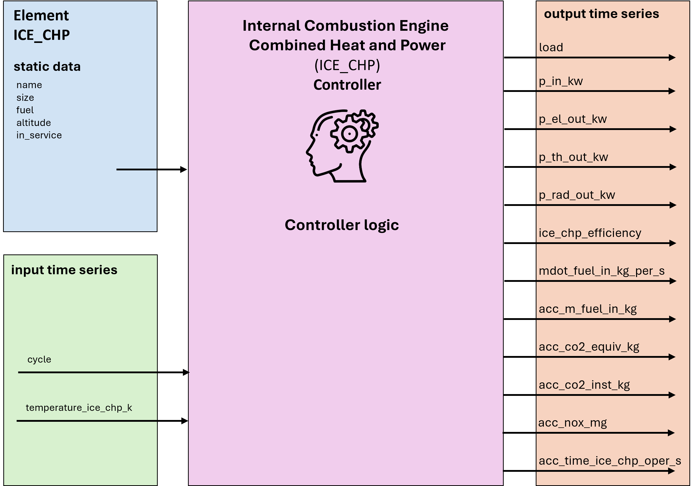

.. _ice_chp_element:

=======================================================
Internal Combustion Engine Combined Heat & Power
=======================================================

.. seealso::
    :ref:`Unit Systems and Conventions <conventions>`

.. note::
    An internal combustion engine (ICE) combined heat & power (CHP) element consists of one element and one controller. 
    The element defines its physical parameters, while the controller governs the operational logic. 
    
    The *create_controlled* function creates both and connects them.
    
    
Create Controlled Function
===========================

.. autofunction:: pandaprosumer2.create_controlled_ice_chp

Controller
=================

Input Static Data
=========================

.. list-table:: 
   :widths: 5 20 5
   :header-rows: 1

   * - Parameter
     - Description
     - Unit
   * - name
     - Unique name or identifier for the ICE CHP element
     - N/A
   * - size
     - ICE CHP rating (nominal max. electrical power)
     - kW
   * - fuel
     - Fuel type used in the calculation
     - N/A
   * - altitude
     - Altitude above sea level of the ICE CHP installation site
     - m

Input Time Series 
======================

.. list-table:: 
   :widths: 5 15 5
   :header-rows: 1

   * - Parameter
     - Description
     - Unit
   * - cycle
     - Output preference: electricity or heat
     - N/A
   * - temp_intake_k
     - Air intake temperature (e.g. ambient air temperature)
     - K

Output Time Series
======================

.. list-table:: 
   :widths: 5 30 5
   :header-rows: 1

   * - Output
     - Description
     - Unit
   * - load
     - Percentage of the ICE CHP max. output power
     - N/A
   * - p_in_kw
     - Total input energy flow (from the fuel)
     - kW
   * - p_el_out_kw
     - Electrical power on the generator
     - kW
   * - p_th_out_kw
     - Recovered heat flow 
     - kW
   * - p_rad_out_kw
     - Radiated heat flow 
     - kW
   * - ice_chp_efficiency
     - ICE CHP's total efficiency (electrical + thermal) 
     - N/A
   * - mdot_fuel_in_kg_per_s
     - Required fuel mass flow 
     - kg/s
   * - acc_m_fuel_in_kg
     - Total mass of fuel consumed 
     - kg
   * - acc_co2_equiv_kg
     - Total mass of CO2-equivalent emissions 
     - kg
   * - acc_co2_inst_kg
     - Total mass of CO2 emissions (emissions at ICE CHP location) 
     - kg
   * - acc_nox_mg
     - Total mass of NOx emissions 
     - mg
   * - acc_time_ice_chp_oper_s
     - Total time of ICE CHP operation
     - s
 
 
Mapping
===========

The ICE CHP Controller can be mapped using the Generic Mapping Scheme.

* No **inputs** are mapped as ICE CHP is an independent energy source 

* The following **outputs** can be mapped:
    
    * p_el_out_kw
    
    * p_th_out_kw

.. note::
    **Input file values and the mapping setup:**

    * If the mapped output is electrical power (p_el_out_kw), the recommended value of the time-dependant input **cycle** is **1**.  
    
    * If the mapped output is thermal power, i.e. heat (p_th_out_kw), the recommended value of the time-dependant input **cycle** is **2**.
    
    In case the cycle and the mapped output don't match, the ICE CHP will pair the demand to the mapped output, which may lead to inaccuracies.
    
    Example: For the given heat demand *q_demand_kw = 500 kW*, the expected output of a (700 kW) ICE CHP is *p_th_out_kw = 500 kW*. However, if *cycle = 1*, 
    but the mapped output is *p_th_out_kw*, the ICE CHP module will give the following output values:
    
    * *p_el_out_kw = 500 kW* 
    
    * *p_th_out_kw = 495 kW*
    
    Because the instruction to the ICE CHP module is that electrical power (*p_el_out_kw*) is preferred, it will try to match electrical power to the demand 
    and the level of recovered heat will be lower than the demanded energy flow. 
    
    Particular care should be taken when the ICE CHP module is connected to more consumers (more than one demand), especially where one consumer demands heat 
    and another demands electrical power.

Model
=================
The ICE CHP module is map based. Its response is read from tabulated data contained 
in a map associated with the chosen size of the ICE CHP. Maps for three sizes are provided: 

* 350 kWe,
* 700 kWe,
* 1400 kWe. 

They are stored in a dedicated JSON file in *pandaprosumer2/library/chp_maps/ice_chp_maps.json* to make modifications 
to the maps easier. If required, maps can be added or removed. However, in case of changes, their sizes must be added to or removed from 
the *chp_ice_size_kw* list. All sizes should be in kW. The file should not contain two or more maps 
of the same size. The minimum information in an ICE CHP map should include the following:

* *temperature_reference_k*: the temperature at which values in the map were measured (in K)
* *altitude_reference_m*: the altitude at which values in the map were measured (in m)
* *pressure_reference_pa*: air intake pressure at which values in the map were measured (in Pa)
* *air_molar_mass_kg_per_mol*: average molar mass of intake air at the location of measurement (in kg/mol)
* *gravitational_acc_m_per_s2*: gravitational acceleration at the location of measurement (in m/s2)
* *universal_gas_const_j_per_molk*: the value of the universal gas constant (in J/molK)
* *load_limits_percent*: minimum and maximum limits below and above which the CHP should not operate (in % of maximum load)
* *engine_load_percent*: a list of load values at which measurements were taken (in % of maximum load)
* *power_el_kw*: a list of values for the power on the electrical generator at each load (in kW)
* *energy_flow_input_kw*: required input energy flow for each load value (in kW)
* *heat_flow_radiation_kw*: the amount of radiation emitted at each load (in kW)
* *heat_flow_recovered_kw*: total recovered heat flow at each load (in kW); provided maps include contributions from the jacket water (cooling) and the exhaust recovered to 150°C
* *exhaust_flow_rate_m3n_per_h*: the rate of the exhaust flow (in m3N/h)
* *emiss_rate_nox_mg_per_m3n*: an average rate of NOx emissions (in mg/m3N)

If data for the parameters above is not available, a value of zero should be used, except for *temperature_reference_k* for which a 
value of 293 is recommended instead of zero. Other information can be included for completeness, 
but will not be used by the program. 

Similarly to the engine, information about available 
fuels is stored in a dedicated JSON file in *pandaprosumer2/library/chp_maps/fuel_maps.json*. Data for seven types of gaseous fuels is provided.

.. list-table:: Fuel Types and Production Methods
   :widths: 5 15 60 10
   :header-rows: 1

   * - Input key
     - Fuel type
     - Production method
     - Ref.
   * - ng
     - Natural gas
     - 
     - :cite:`Guilera2021`
   * - sng1
     - Sythetic natural gas 1
     - Biogas catalytic methanation with 38% renewable electricity mix
     - :cite:`Guilera2021`
   * - sng2
     - Sythetic natural gas 2
     - Biogas catalytic methanation with 100% renewable electricity mix
     - :cite:`Guilera2021`
   * - sng3
     - Sythetic natural gas 3
     - Catalytic methanation from green H2 and CO2 sourced from iron/steel processing
     - :cite:`Lee2024`
   * - sng4
     - Sythetic natural gas 4
     - Catalytic methanation from green H2 and CO2 sourced from direct air capture
     - :cite:`Lee2024`
   * - sng5
     - Sythetic natural gas 5
     - Catalytic methanation from green H2 and CO2 sourced from ethanol production
     - :cite:`Lee2024`
   * - sng6
     - Sythetic natural gas 6
     - Catalytic methanation from green H2 and CO2 sourced from ammonia production
     - :cite:`Lee2024`

Data in the fuel map can also be modified if required. It should include at least the following:

* *fuel_types*: a list of available fuel types
* *lower_heating_value_kwh_per_kg*: a list of lower heating value parameters associated with each type of fuel (in kWh/kg)
* *carbon_fraction*: the percentage of carbon weight to total molecule weight for each type of fuel
* *co2eq_kg_per_kwh*: CO2 equivalent emissions for each fuel type (in kg/kWh)  

An instance of the ICE CHP is defined by its size, fuel type, and altitude. A CHP map is selected based on the chosen size. If the size is not in the *chp_ice_size_kw* list, the program will choose one size larger 
to guarantee that the chosen maximum power can be obtained. In the case where the chosen size is outside of the available range, the program 
will print a warning to the console and will shut down before starting calculations. 

.. figure:: ice_chp.png
    :width: 100em
    :alt: An example of reading map data.
    :align: center

    An example of how the ICE CHP module reads the value of recovered heat flow from its map, which takes the (thermal) power requirement as basis for determining the load at each time step. (source: University of Ljubljana, Faculty of Mechanical Engineering)

At each time step the algorithm follows the procedure described below:

1. Based on the current demand, the reference CHP load :math:`L_\text{ref}` is determined from the map:

* A check is performed to determine the preferred output - (1) electricity or (2) heat
* For electricity, the demand is compared against values in *power_el_kw*, while for heat is compared against *heat_flow_recovered_kw* 
* If the demand exceeds the maximum values, the load is set to 100%
* If the demand is not equal to any of the values in *engine_load_percent*, the algorithm performs a piece-wise linear interpolation

2.  The actual load :math:`L_\text{act}`, i.e. the load perceived by the engine, is calulated next:

.. math::
    :nowrap:

    \begin{align*}
        L_\text{act} &= L_\text{ref} \, r_\text{air}  \\
    \end{align*}

* A ratio :math:`r_\text{air}` betwen the reference and actual intak air density is calculated to take into account the effects of different ambient temperatures and altitudes. The perfect gas law is used to calculate air densities since air is assumed to be dry and homogeneously mixed.
* For consistency, if :math:`r_\text{air} > 1`, then :math:`r_\text{air} = 1`

3. Obtained load limits are compared against the values in *load_limits_percent*:

* If :math:`L_\text{act}` is below the lower limit, the ICE CHP is considered to be switched off and :math:`L_\text{act} = 0`
* If :math:`L_\text{act}` is bigger than the upper limit, :math:`L_\text{act}` is set to the upper limit

4. Parameter values associated with the calculated load are read or interpolated from the map:

* Input: required input energy :math:`P_\text{in}` (in kW) - from *energy_flow_input_kw*
* Output: electrical energy on the generator :math:`P_\text{el}` (in kW) - from *power_el_kw*
* Output: recovered thermal energy :math:`P_\text{th}` (in kW) - from *heat_flow_recovered_kw*
* Output: radiated thermal energy :math:`P_\text{rad}` (in kW) - from *heat_flow_radiation_kw*

5. Fuel consumption is calculated in two ways:

* Fuel mass flow :math:`P_\text{el}` (in kg/s):

.. math::
    :nowrap:

    \begin{align*}
        \dot{m}_\text{fuel} &= \frac{P_\text{in}}{LHV} \\
    \end{align*}
    
where :math:`LHV` (in kWh/kg) is the lower heating value obtained from the fuel map (*lower_heating_value_kwh_per_kg*) for the selected type of fuel 

* Total mass of fuel consumed (in kg) from the start of the calculation to the current time step : 

.. math::
    :nowrap:

    \begin{align*}
        m_\text{fuel} &= \sum\dot{m}_\text{fuel} \, \Delta t   \\
    \end{align*}

where :math:`\Delta t` is the duration of the time step (in s)

6. Three typical emissions are calculated in the following way:

* CO2 mass flow (in kg/s) at the location of the ICE CHP:

.. math::
    :nowrap:

    \begin{align*}
        \dot{m}_{\text{CO}_2} &= \dot{m}_\text{fuel} \, r_\text{C} \, \left(\frac{M_{\text{CO}_2}}{M_\text{C}}\right) \\
    \end{align*}

where :math:`r_\text{C}` is the carbon fraction for the chosen fuel obtained from the fuel map (*carbon_fraction*). :math:`M_{\text{CO}_2}` and :math:`M_\text{C}` represent molar masses of CO2 and C (in kg/mol), respectively. 

* CO2-equivalent mass flow (in kg/s): 

.. math::
    :nowrap:

    \begin{align*}
        \dot{m}_{\text{CO}_{2}eq} &= P_\text{in} \, r_\text{eq} \, \left(\frac{1}{3600}\right) \\
    \end{align*}

where :math:`r_\text{eq}` (kg/kWh) is the rate of CO2-equivalent emissions specified in the fuel map (*co2eq_kg_per_kwh*).

* NOx mass flow (in mg/s):

.. math::
    :nowrap:

    \begin{align*}
        \dot{m}_{\text{NO}_{x}} &= \dot{V}_\text{exh} \, q_{\text{NO}_x} \, \left(\frac{1}{3600}\right)\\
    \end{align*}

where :math:`\dot{V}_\text{exh}` is the volumetric flow of exhaust gases (in m3N/h) and :math:`q_{\text{NO}_x}` is the rate of NOx emissions (in mg/m3N). Both are properties of the ICE CHP and their values are specified in the CHP map, *exhaust_flow_rate_m3n_per_h* and *emiss_rate_nox_mg_per_m3n*, respectively

.. note::

    * Results for CO2 and CO2-equivalent emissions are given in **kg/s**

    * Results for NOx emissions are given in **mg/s**

7. Information about the ICE CHP efficiency and total time of operation is also provided: 

* The total time is a sum of time steps during which the CHP load is not zero, i.e. it is considered to be operating 

* The total efficiency is calculated with the formula shown below:

.. math::
    :nowrap:

    \begin{align*}
        \eta_\text{tot} &= \left(\frac{P_\text{th} + P_\text{el}}{P_\text{in}}\right) * 100 \\
    \end{align*}
