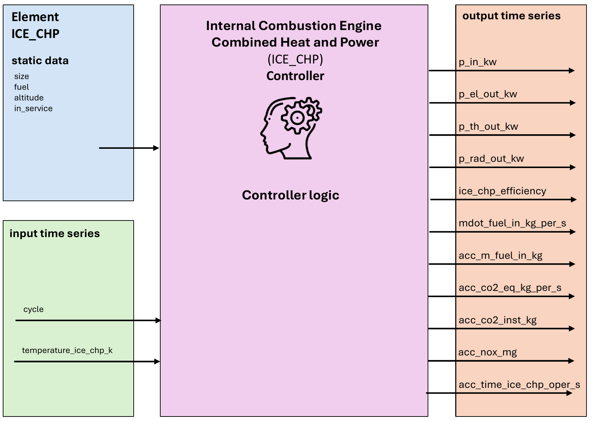
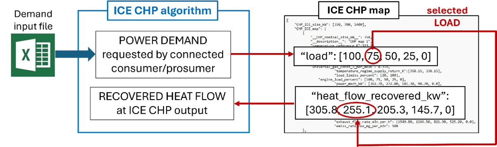
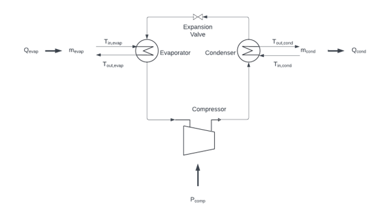

.. _ice_chp_element:

================================================
Internal Combustion Engine Combined Heat & Power
================================================

.. seealso::
    :ref:`Unit Systems and Conventions <conventions>`

.. note::
    An internal combustion Engine consists of an element and a controller. The element defines it's physical parameters,
    while the controller governs the operational logic.

    The create_controlled function creates both and connects them.

Create Controlled Function
======================================

.. autofunction:: pandaprosumer.create_controlled_ice_chp

Controller
===========

    ..

.. raw:: html

    

Input Static Data
--------------------

.. csv-table::
    :header: "Parameter", "Description", "Unit"

    "size", "Size of the system", "m³"
    "fuel", "Type of fuel used", "N/A"
    "altitude", "Altitude in meters", "m"
    "in_service", "Indicates if the system is in service", "N/A"
    "name", "Custom name for the instance", "N/A"

Input Time Series
-------------------

.. csv-table::
    :header: "Parameter", "Description", "Unit"

    "cycle", "Cycle number of the process", "N/A"
    "t_intake_k", "Intake temperature in Kelvin", "K"

Output Time Series
-------------------

.. csv-table::
    :header: "Parameter", "Description", "Unit"

    "load", "Load on the system", "N/A"
    "p_in_kw", "Input power in kilowatts", "kW"
    "p_el_out_kw", "Electrical output power in kilowatts", "kW"
    "p_th_out_kw", "Thermal output power in kilowatts", "kW"
    "p_rad_out_kw", "Radiative output power in kilowatts", "kW"
    "ice_chp_efficiency", "ICE CHP efficiency", "%"
    "mdot_fuel_in_kg_per_s", "Mass flow rate of fuel input", "kg/s"
    "acc_m_fuel_in_kg", "Accumulated fuel input mass", "kg"
    "acc_co2_equiv_kg", "Accumulated CO2 equivalent emissions", "kg"
    "acc_co2_inst_kg", "Instantaneous CO2 emissions", "kg"
    "acc_nox_mg", "Accumulated NOx emissions", "mg"
    "acc_time_ice_chp_oper_s", "Accumulated operational time of ICE CHP", "s"

Mapping
----------------

The Internal Combustion Engine model can be mapped using :ref:`GenericMapping <GenericMapping>`.

Model
=================

.. autoclass:: pandaprosumer.controller.models.ice_chp.IceChpController
    :members:

The ICE CHP module is map based. Its engine response is read from tabulated data contained 
in a map associated with the chosen size of the ICE CHP. Maps for three sizes are provided: 

* 350 kWe,
* 700 kWe,
* 1400 kWe. 

They are stored in a dedicated JSON file in *pandaprosumer/library/chp_maps/ice_chp_maps.json* to make modifications
to the maps easier if required. If maps are added or removed, their sizes must be added to or removed from 
the *"chp_ice_size_kw"* list. All sizes should be in kW. The file should not contain two or more maps 
of the same size. The minimum information in an ICE CHP map should include the following:

* *temperature_reference_k*: the temperature at which values in the map were measured (in K)
* *altitude_reference_m*: the altitude at which values in the map were measured (in m)
* *pressure_reference_pa*: air intake pressure at which values in the map were measured (in Pa)
* *air_molar_mass_kg_per_mol*: average molar mass of intake air at the location of measurement (in kg/mol)
* *gravitational_acc_m_per_s2*: gravitational acceleration at the location of measurement (in m/s2)
* *universal_gas_const_j_per_molk*: the value of the universal gas constant (in J/molK)
* *load_limits_percent*: minimum and maximum limits below and above which the CHP should not operate (in % of maximum load)
* *engine_load_percent*: a list of load values at which measurements were taken (in % of maximum load)
* *power_el_kw*: a list of values for the power on the electrical generator at each load (in kW)
* *energy_flow_input_kw*: required input energy flow for each load value (in kW)
* *heat_flow_radiation_kw*: the amount of radiation emitted at each load (in kW)
* *heat_flow_recovered_kw*: total recovered heat flow at each load (in kW); provided maps include contributions from the jacket water (cooling) and the exhaust recovered to 150°C
* *exhaust_flow_rate_m3n_per_h*: the rate of the exhaust flow (in m3N/h)
* *emiss_rate_nox_mg_per_m3n*: an average rate of NOx emissions (in mg/m3N)

Except for *temperature_reference_k*, if data for the parameters above is not available, a value of zero should be used. 
For *temperature_reference_k* a value of 293 is recommended instead of zero. Other information can be included for completeness, 
but will not be used by the program. 

Similarly to the engine, properties of available 
fuels is stored in a dedicated JSON file in *pandaprosumer/library/chp_maps/fuel_maps.json*. Data for seven types of gaseous fuels is provided.

.. list-table:: Fuel Types and Production Methods
   :widths: 5 15 60 10
   :header-rows: 1

   * - Code
     - Fuel type
     - Production method
     - Ref.
   * - ng
     - Natural gas
     - 
     - :cite:`Guilera2021`
   * - sng1
     - Sythetic natural gas 1
     - Biogas catalytic methanation with 38% renewable electricity mix
     - :cite:`Guilera2021`
   * - sng2
     - Sythetic natural gas 2
     - Biogas catalytic methanation with 100% renewable electricity mix
     - :cite:`Guilera2021`
   * - sng3
     - Sythetic natural gas 3
     - Catalytic methanation from green H2 and CO2 sourced from iron/steel processing
     - :cite:`Lee2024`
   * - sng4
     - Sythetic natural gas 4
     - Catalytic methanation from green H2 and CO2 sourced from direct air capture
     - :cite:`Lee2024`
   * - sng5
     - Sythetic natural gas 5
     - Catalytic methanation from green H2 and CO2 sourced from ethanol production
     - :cite:`Lee2024`
   * - sng6
     - Sythetic natural gas 6
     - Catalytic methanation from green H2 and CO2 sourced from ammonia production
     - :cite:`Lee2024`

Data in the fuel map can also be modified if required. It should include at leat the following:

* *fuel_types*: a list of available fuel types
* *lower_heating_value_kwh_per_kg*: a list of lower heating value parameters associated with each type of fuel (in kWh/kg)
* *carbon_fraction*: the percentage of carbon weight to total molecule weight for each type of fuel
* *co2eq_kg_per_kwh*: CO2 equivalent emissions for each fuel type (in kg/kWh)  

An instance of the ICE CHP is defined by its size, fuel type, and altitude. A CHP map is selected based on the size. 

    An example of reading data from an ICE CHP map. (source: Faculty of Mechanical Engineering, University of Ljubljana)

The evaporator of the heat pump should get heat from a District Heating Network or from the ambient air.

The condenser should be connected to downstream elements in the prosumer or to a District Heating Network.

    Schematic representation of a thermal-based heat pump considered by EIFER during modeling (source: own creation)

To understand the thermal-based heat pump model developed by EIFER, it is first necessary to have an overview of the
technologies and parameters involved in the modelling of a heat pump.
Figure 4 offers a schematic representation of a thermal-based heat pump considered by EIFER during modelling.

The thermal-based heat pump modelled includes a compressor, a condenser, an expansion valve, and an evaporator.
In general terms, a heat pump requires a certain amount of power :math:`P_\text{comp}`, it transfers a certain
amount of heat :math:`Q_\text{cond}` to the heat sink, and it absorbs a certain amount of
heat :math:`Q_\text{evap}` from the heat source.

The thermal-based heat pump model developed by EIFER calculates the required heat pump mass flow on the
evaporator (:math:`\dot{m}_\text{evap}`) to produce enough heat (Qcond) to meet the requirements of the network
in terms of temperature increase (:math:`T_{\text{out}_\text{cond}} - T_{\text{in}_\text{cond}}`) with
a given mass flow (:math:`\dot{m}_\text{cond}`).

To do so, a series of parameters are required as a given input from the model developed:

* :math:`T_{\text{out}_\text{cond}}`: target temperature need from the network.
* :math:`T_{\text{in}_\text{cond}}`: return temperature from the network to the considered HP.
* :math:`\dot{m}_\text{cond}`: mass flow in the network, which for simplicity is considered water.
* :math:`T_{\text{in}_\text{evap}}`: temperature of the heat source at the inlet of the evaporator.
* :math:`\Delta T_\text{evap}`: it is the temperature difference between the inlet and outlet of the evaporator on the heat source side.
* :math:`Pinch`: it is a small temperature difference, usually in between 5-10 K, to account for
  temperature difference between the heat pump side and the heat source (or heat sink) side.
* :math:`\eta_\text{C}`: Carnot efficiency, usually between 0.4-0.6, used to simplify the calculation of the heat pump COP
* :math:`T_{\text{out}_{\text{cond}_\text{max}}}`: it is the maximum temperature that can be achieved at the outlet
  of the condenser on the heat sink side, it is usually given from the HP manufacturer and it depends on the refrigerant chosen.

Then, the calculation steps modelled follow the equations presented below:

1.	The first step is to calculate the condenser thermal demand :math:`Q_\text{cond}`, meaning the thermal need from the network

.. math::
    :nowrap:

    \begin{align*}
        Q_\text{cond} &= \dot{m}_\text{cond} * Cp_\text{cond} * (T_{\text{out}_\text{cond}} - T_{\text{in}_\text{cond}})  \\
    \end{align*}

Where :math:`Cp_\text{cond}` is the specific heat capacity at constant pressure of the fluid used in the heat network,
which is usually water

2. Then the temperature at the outlet of the evaporator is calculated (:math:`T_{\text{out}_\text{evap}}`)

.. math::
    :nowrap:

    \begin{align*}
        T_{\text{out}_\text{evap}} &= T_{\text{in}_\text{evap}} + \Delta T_\text{evap}  \\
    \end{align*}

3. Thanks to step n°2 it is possible to calculate the Carnot COP (:math:`COP_\text{C}`)

.. math::
    :nowrap:

    \begin{align*}
        COP_\text{C} &= \frac{T_{\text{out}_\text{cond}} + T_\text{pinch} + 273.15\text{K}}{T_{\text{out}_\text{cond}} - T_{\text{in}_\text{evap}}}  \\
    \end{align*}

4. Which allows a simplified calculation of the heat pump COP (:math:`COP_\text{HP}`)

.. math::
    :nowrap:

    \begin{align*}
        COP_\text{HP} &= \eta_\text{C} *  COP_\text{C} \\
    \end{align*}

5. The required electrical power :math:`P_\text{comp}` to provide :math:`Q_\text{cond}` is also calculated

.. math::
    :nowrap:

    \begin{align*}
        P_\text{comp} &= \frac{Q_\text{comp}}{COP_\text{HP}}  \\
    \end{align*}

6. From which it is possible to derive the heat required from the heat source :math:`Q_\text{evap}`

.. math::
    :nowrap:

    \begin{align*}
        Q_\text{evap} &= Q_\text{cond} - P_\text{comp}  \\
    \end{align*}

7. And finally the mass flow :math:`\dot{m}_\text{evap}` needed at the evaporator for the HP to provide the
   required :math:`Q_\text{cond}`
   Where :math:`Cp_\text{evap}` is the specific heat capacity at constant pressure of the fluid used in the heat sink

.. math::
    :nowrap:

    \begin{align*}
        \dot{m}_\text{evap} &= \frac{Q_\text{evap}}{Cp_\text{evap} * \Delta T_\text{evap}}  \\
    \end{align*}

8. It is important to check that the temperature at the outlet of the condenser is not above the maximum temperature
   achievable from the considered HP with the given refrigerant, otherwise that means that the maximum heat that can be
   provided to the network is lower than the requirement

.. math::
    :nowrap:

    \begin{align*}
        \text{if}\ T_{\text{out}_\text{cond}} > T_{\text{out}_{\text{cond}_\text{max}}}\
        \text{then}\ Q_\text{cond} &= \dot{m}_\text{cond} * Cp_\text{cond} * (T_{\text{out}_{\text{cond}_\text{max}}} - T_{\text{in}_\text{cond}})  \\
    \end{align*}

    The COP and power consumption are then recalculated based on the new :math:`Q_\text{cond}`.

9.  If the COP is higher than the maximum COP of the HP, the power consumption is set to the maximum power, 
    :math:`T_{\text{out}_\text{cond}}` is also recalculated based on the maximum COP.

10. If the power consumption is higher than the maximum power of the HP, :math:`\dot{m}_\text{cond}` is
    recalculated so that the power consumption is set to the maximum power.

.. math::
    :nowrap:

    \begin{align*}
        \text{if}\ P_\text{comp} > P_{\text{comp}_\text{max}}\
        \text{then}\ \dot{m}_\text{cond} &= \frac{P_{\text{comp}_\text{max}} * COP_\text{HP}}{Cp_\text{cond} * (T_{\text{out}_\text{cond}} - T_{\text{in}_\text{cond}})}  \\
    \end{align*}

11.  If the power consumption is lower than the minimum power of the HP, the heat pump is considered off and
     the power consumption is set to zero,

.. note::
    **Limitations of the model:**

    * Assume a constant :math:`\Delta T_\text{evap}`

    * Assume a constant :math:`\eta_\text{C}`
