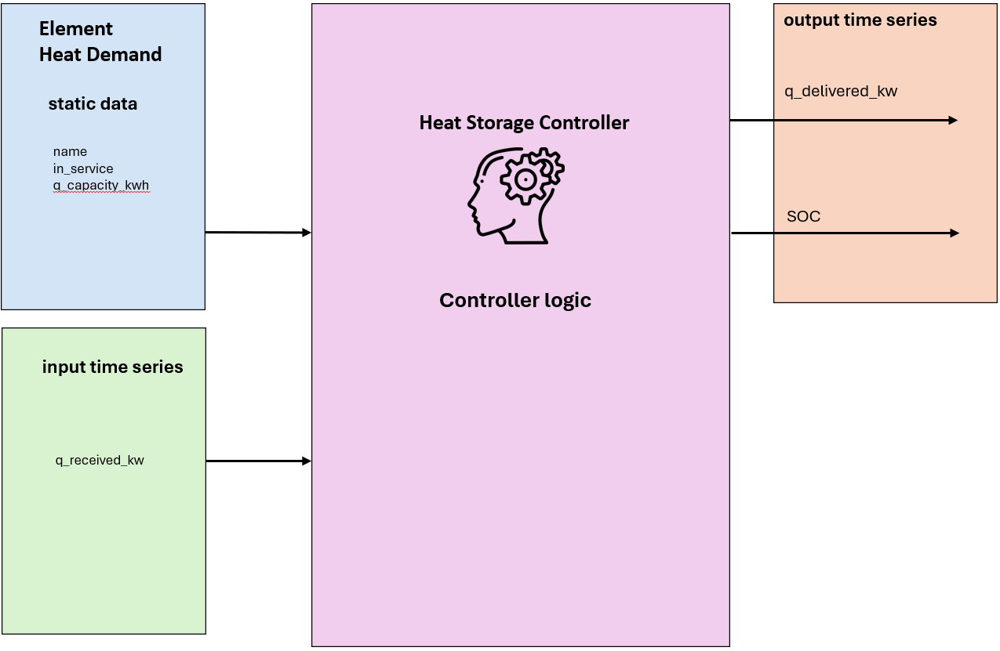

.. _heat_storage_element:

==================
Heat Storage
==================

.. seealso::
    :ref:`Unit Systems and Conventions <conventions>`

.. note::
    A Heat Storage consists of an element and a controller. The element defines it's physical parameters,
    while the controller governs the operational logic.

    The create_controlled function creates both and connects them.

Create Controlled Function
===========================

.. autofunction:: pandaprosumer.create_controlled_heat_storage

Controller
========================

    ..

.. raw:: html

    

Input Static Data
-------------------

.. csv-table::
    :header: "Parameter", "Description", "Unit"

    "name", "Custom name for the Storage", "N/A"
    "in_service", "Indicates if the Storage is in service", "N/A"
    "q_capacity_kwh", "Capacity in kilowatt-hours", "kWh"

Input Time Series
--------------------

.. csv-table::
    :header: "Parameter", "Description", "Unit"

    "q_received_kw", "Received heat power", "kW"

Output Time Series
---------------------

.. csv-table::
    :header: "Parameter", "Description", "Unit"

    "soc", "State of Charge", "%"
    "q_delivered_kw", "Delivered heat power", "kW"

Mapping
----------

The Simple Storage model model can be mapped using :ref:`GenericMapping <GenericMapping>`.

Model
=================

.. autoclass:: pandaprosumer.controller.models.HeatStorageController
    :members:

The heat storage model computes the heat received and delivered by the storage element, and updates the state of charge (SOC) accordingly.

.. math::
    :nowrap:

    \begin{align*}
        E_\text{received} &= \dot{Q}_\text{received} \cdot \frac{\Delta t}{3600} \\
        E_\text{delivered} &= \dot{Q}_\text{delivered} \cdot \frac{\Delta t}{3600} \\
        \text{SOC}_{t+1} &= \frac{E_\text{stored}}{Q_\text{capacity}} = \frac{E_\text{stored, t} + E_\text{received} - E_\text{delivered}}{Q_\text{capacity}} \\
    \end{align*}

The SOC is adjusted each timestep to reflect the energy balance within the storage unit.
If the requested heat exceeds available storage, the delivery is capped to the actual available energy.

