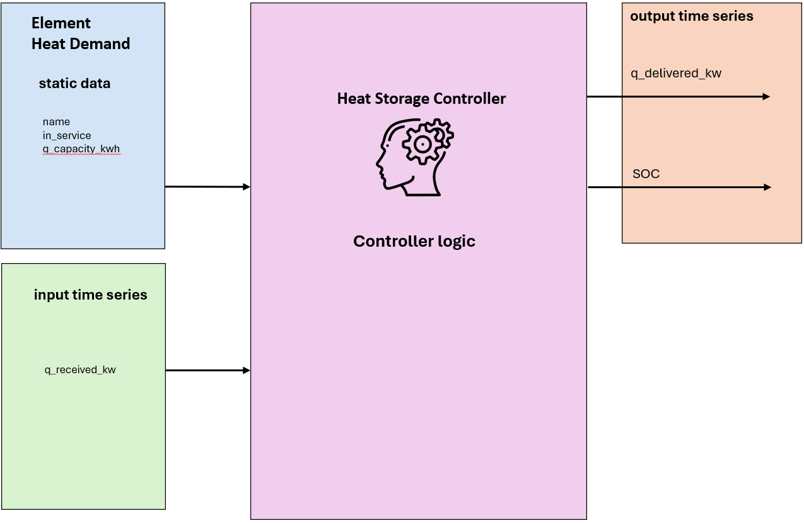

.. _heat_storage_element:

==================
Heat Storage
==================

.. seealso::
    :ref:`Unit Systems and Conventions <conventions>`

.. note::
    A Heat Storage consists of an element and a controller. The element defines it's physical parameters,
    while the controller governs the operational logic.

    The create_controlled function creates both and connects them.

Create Controlled Function
===========================

.. autofunction:: pandaprosumer.create_controlled_heat_storage

Controller
========================

    ..

.. raw:: html

    

Input Static Data
-------------------

.. csv-table::
    :header: "Parameter", "Description", "Unit"

    "name", "Custom name for the Storage", "N/A"
    "in_service", "Indicates if the Storage is in service", "N/A"
    "e_capacity_kwh", "Capacity in kilowatt-hours (power-only mode)", "kWh"
    "capacity_kg", "Tank fluid mass; if set, enables FluidMix / uniform tank mode", "kg"
    "init_temperature_c", "Initial uniform tank temperature (FluidMix mode)", "°C"
    "min_temp_c", "Minimum temperature for SOC from T (optional, FluidMix)", "°C"
    "max_temp_c", "Maximum temperature for SOC from T (optional, FluidMix)", "°C"
    "u_w_per_m2k", "Wall U-value for heat losses (FluidMix)", "W/(m²·K)"
    "area_wall_m2", "Wall area for heat losses (FluidMix)", "m²"
    "t_ext_c", "Ambient temperature for heat losses (FluidMix)", "°C"

Input Time Series
--------------------

.. csv-table::
    :header: "Parameter", "Description", "Unit"

    "q_received_kw", "Received heat power", "kW"

Output Time Series
---------------------

.. csv-table::
    :header: "Parameter", "Description", "Unit"

    "soc", "State of Charge", "%"
    "q_delivered_kw", "Delivered heat power", "kW"

Mapping
----------

The heat storage controller can be connected with:

- **GenericMapping**: power only (input ``q_received_kw``; output ``soc``, ``q_delivered_kw``).
- **FluidMixMapping**: temperature and mass flows (uniform tank). Set ``capacity_kg`` on the element to enable; optionally set ``init_temperature_c``, ``min_temp_c``, and ``max_temp_c`` to derive SOC from tank temperature.

Model
=================

.. autoclass:: pandaprosumer.controller.models.HeatStorageController
    :members:

The heat storage model supports two modes. With **GenericMapping** (power only), it computes the heat received and delivered and updates SOC from the energy balance. With **FluidMixMapping** (element ``capacity_kg`` set), it uses a uniform tank with temperature and mass flows; if ``min_temp_c`` and ``max_temp_c`` are set, SOC is computed from the tank temperature as :math:`\mathrm{SOC} = (T - T_{\min}) / (T_{\max} - T_{\min})` (clipped to [0, 1]).

.. math::
    :nowrap:

    \begin{align*}
        E_\text{received} &= \dot{Q}_\text{received} \cdot \frac{\Delta t}{3600} \\
        E_\text{delivered} &= \dot{Q}_\text{delivered} \cdot \frac{\Delta t}{3600} \\
        \text{SOC}_{t+1} &= \frac{E_\text{stored}}{Q_\text{capacity}} = \frac{E_\text{stored, t} + E_\text{received} - E_\text{delivered}}{Q_\text{capacity}} \\
    \end{align*}

The SOC is adjusted each timestep to reflect the energy balance within the storage unit.
If the requested heat exceeds available storage, the delivery is capped to the actual available energy.

