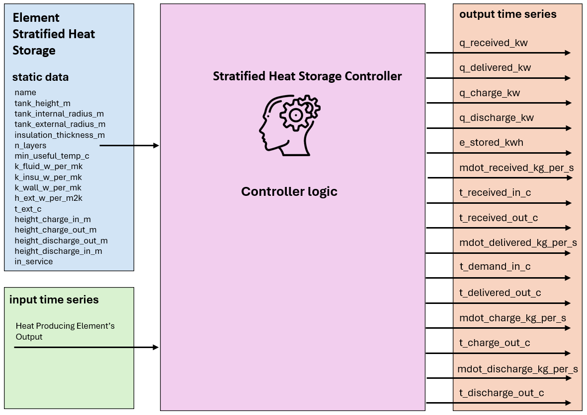
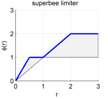

.. _stratified_heat_storage_element:

========================
Stratified Heat Storage
========================

.. seealso::
    :ref:`Unit Systems and Conventions <conventions>`

.. note::
    A Stratified Heat Storage consists of an element and a controller. The element defines it's physical parameters,
    while the controller governs the operational logic.

    The create_controlled function creates both and connects them.

Create Controlled Function
=============================

.. autofunction:: pandaprosumer.create_controlled_stratified_heat_storage

Controller
===========================

.. raw:: html

    

Input Static Data
--------------------

.. csv-table::
    :header: "Parameter", "Description", "Unit"

    "name", "A custom name for this Stratified Heat Storage", "N/A"
    "tank_height_m ", "The height of the storage tank", "m"
    "tank_internal_radius_m  ", "The internal radius of the storage tank", "m"
    "tank_external_radius_m  ", "tank_external_radius (without insulation)", "m"
    "insulation_thickness_m  ", "insulation thickness", "m"
    "n_layers  ", " Number of layers used for the calculations", "N/A"
    "min_useful_temp_c  ", "Temperature used as a threshold to calculate the amount of stored energy", "Degree Celsius"
    "k_fluid_w_per_mk  ", "Thermal conductivity of storage fluid (prosumer.fluid)", "Degree Celsius"
    "k_insu_w_per_mk ", "Thermal conductivity of insulation", "W/(mK)"
    "k_wall_w_per_mk  ", "Thermal conductivity of the tank wall", "W/(mK)"
    "h_ext_w_per_m2k  ", "Heat transfer coefficient with the environment (Convection between tank and air)", "W/(m²K)"
    "t_ext_c ", "The ambient temperature used for calculating heat losses", "Degree Celsius"
    "max_remaining_capacity_kwh  ", "The difference between the maximum energy that can be stored in the storage and\\ the actual stored energy from which the storage will not require to be filled anymore", "kWh"
    "t_discharge_out_tol_c  ", "The maximum allowed difference between the demand temperature and the temperature of\\ the top layer in the storage to allow supplying the demand", "Degree Celsius"
    "max_dt_s  ", "The temporal resolution of the storage calculation. Default to the period resolution.\\ May cause divergence of the model if too high.", "second"
    "height_charge_in_m  ", "The height of the inlet charging point in m.", "m"
    "height_charge_our_m  ", "The height of the outlet charging point in m.", "m"
    "height_discharge_in_m  ", "The height of the inlet discharging point in m.", "m"
    "height_discharge_out_m  ", "The height of the outlet discharging point in m.", "m"

Input Time Series
-------------------

.. csv-table::
    :header: "Parameter", "Description", "Unit"

    "mdot_discharge_kg_per_s", "Mass flow rate of discharge", "kg/s"
    "t_discharge_c", "Discharge temperature", "°C"
    "q_delivered_kw", "Delivered heat power", "kW"
    "e_stored_kwh", "Stored energy", "kWh"

Output Time Series
-------------------

.. csv-table::
    :header: "Parameter", "Description", "Unit"

    "mdot_discharge_kg_per_s ", "The storage discharge mass flow", "kg/s"
    "t_discharge_c ", "The storage discharge temperature", "Degree Celsius"
    "q_delivered_kw ", "The storage delivered power to the downstream elements", "kW"
    "e_stored_kwh ", "The total stored heat energy in the storage above the element minimum usefully temperature compared to the initial state", "kWh"

Mapping
-----------------------
The Stratified Heat Storage Controller can be mapped using :ref:`FluidMixMapping <FluidMixMapping>`.

- The stratified heat storage can be used as responder for a FluidMix mapping, taking the output from another controller as its input

- The stratified heat storage can be used as initiator for a FluidMix mapping, making its output to another controller

   
Model
=================

.. autoclass:: pandaprosumer.controller.models.StratifiedHeatStorageController
    :members:

Thermal energy storage means heating or cooling a medium to use the energy when needed later. In its simplest form,
this could mean using a water tank for heat storage, where the water is heated at times when there is a lot of energy,
and the energy is then stored in the water for use when energy is less plentiful. Thermal energy storage can also be
used to balance energy consumption between day and night. Storage solutions include water or storage tanks of ice-slush,
earth or bedrock accessed via boreholes and large bodies of water deep below ground. The Stratified thermal energy
storage model developed is a sensible thermal energy storage that uses a water tank for storing and releasing heat energy.
The stratification inside the storage tank between the hot and the cold water is illustrated in Figure 1 :cite:`Untrau2023`.

    The thermocline region and the temperature profile inside the tank :cite:`Untrau2023`

Assuming constant thermo-physical properties for the storage fluid and no heat source inside the storage tank,
the conservation of energy in 1D leads to the following Partial Differential Equation (P.D.E.) with the temperature T as unknown:

.. math::
    :nowrap:

    \begin{align*}
        \rho \cdot \mathrm{C}_{\mathrm{p}} \cdot \mathrm{~A} \frac{\partial \mathrm{~T}(\mathrm{z}, \mathrm{t})}{\partial \mathrm{t}}+\dot{\mathrm{m}} \cdot \mathrm{C}_{\mathrm{p}} \frac{\partial \mathrm{~T}(\mathrm{z}, \mathrm{t})}{\partial \mathrm{z}}=\mathrm{A} \cdot \mathrm{k} \frac{\partial^2 \mathrm{~T}(\mathrm{z}, \mathrm{t})}{\partial \mathrm{z}^2}+\mathrm{U} \cdot \mathrm{P}\left(\mathrm{~T}_{\mathrm{amb}}(\mathrm{t})-\mathrm{T}(\mathrm{z}, \mathrm{t})\right)
    \end{align*}

The first term is the energy accumulation, the second term represents the enthalpy fluxes due to the charge or discharge,
the third term represents diffusion inside the tank and the final term models the heat losses to the environment.
In this equation, the unknown variable is the storage fluid temperature T(z, t) varying in space,
along the vertical coordinate z, and in time t; ρ represents the stored fluid density, Cp the stored fluid
heat capacity and k the stored fluid thermal conductivity.
They are all assumed uniform and constant. A is the tank cross-sectional area, P is its perimeter.
U is the heat transfer coefficient with the environment.

Boundary conditions at the top and bottom of the storage tank:

When Charging:

.. math::
    :nowrap:

    \begin{align*}
        \left.\frac{\partial \mathrm{T}}{\partial \mathrm{z}}\right|_{z=\mathrm{H}}=0 &; T_{z=H}=T_{\text {charge }}
    \end{align*}

When Discharging:

.. math::
    :nowrap:

    \begin{align*}
        \left.\frac{\partial \mathrm{T}}{\partial \mathrm{z}}\right|_{z=\mathrm{0}}=0 &; T_{z=0}=T_{\text {discharge }}
    \end{align*}

During idle time:

.. math::
    :nowrap:

    \begin{align*}
        \left.\frac{\partial \mathrm{T}}{\partial \mathrm{z}}\right|_{z=\mathrm{0}}=0 &; \left.\frac{\partial \mathrm{T}}{\partial \mathrm{z}}\right|_{z=\mathrm{H}}=0
    \end{align*}

    Finite volume discretization scheme for the stratified thermal energy storage model :cite:`Untrau2023`

The previous Partial Differential Equation is discretized explicitly with the Euler-forward scheme.
The equations used to solve for the new temperature for the different layers i are presented hereafter:

To further improve the numerical stability and accuracy—especially in convection-dominated regimes during charging
or discharging—the model
implements a Total Variation Diminishing (TVD) scheme. This scheme is designed to:

- **Prevent Spurious Oscillations:** By ensuring that the total variation of the temperature profile does not increase over time, the TVD approach avoids non-physical oscillations that can arise with standard upwind or central difference schemes.
- **Preserve Sharp Temperature Gradients:** The TVD method utilizes a flux limiter (the *superbee* limiter) to maintain steep temperature fronts while ensuring numerical stability.

For the first layer at the bottom of the storage tank:

.. math::
    :nowrap:

    \begin{align*}
        \rho C_p A \Delta z \frac{d T_1}{d t} &= U_1 S_1\left(T_{amb}-T_1\right) + \frac{4}{3} \frac{k^* A} {\Delta z}\left(T_2-T_1\right)               + \dot{m}_c C_p\left(T_2-T_1\right)               + \dot{m}_d C_p\left(T_{\text{return}}-T_1\right)
    \end{align*}

For an intermediate layer i, for i varying from 2 to N:

We first define :

.. math::
    \dot{m}_{b} = \dot{m}_{c} - \dot{m}_{d}

Where :math:`\dot{m}_{\text{c}}` is the charging mass flow rate [kg/s] and :math:`\dot{m}_{\text{d}}` is the discharging mass flow rate [kg/s],

The sign of :math:`\dot{m}_{b}` determines the direction of flow:

For positive :math:`\dot{m}_{b}` **(charging):**

.. math::
    \text{term}_3 = \frac{\dot{m}_{b} C_p (T_{i+2}-T_{i+1})}{\rho A}

An additional term incorporating the TVD scheme is included to prevent spurious oscillations:

.. math::
    \text{term}_{33} = -0.5 \cdot \dot{m}_{b} \cdot (1 - \frac{\dot{m}_{b} \cdot \text{resol}}{\rho A \Delta z}) \left( -\Delta T_i \cdot \phi_{i} + \Delta T_{i+1} \cdot \phi_{i+1} \right)

Where :math:`\phi_i` is the superbee limiter function.
and :math:`\Delta T_i = T_{i+1} - T_i`

For negative :math:`\dot{m}_{b}` **(discharging):**

.. math::
    \text{term}_3 = \dot{m}_{b} C_p (T_{i+1}-T_{i})

.. math::
    \text{term}_{33} = +0.5 \cdot \dot{m}_{b} \cdot (1 + \frac{\dot{m}_{b} \cdot \text{resol}}{\rho A \Delta z}) \left( \Delta T_{i+1} \cdot \phi_{i} - \Delta T_i \cdot \phi_{i-1} \right)

The total temperature update for each layer is then:

.. math::
     \rho C_p A \Delta z \frac{d T_i}{d t} = U_1 S_l \cdot (T_{\text{ext}} - T_i) + k^* \frac{A}{\Delta z} \left( \Delta T_{i+1} - \Delta T_i \right) + C_p \cdot (\text{term}_3 + \text{term}_{33})

For the last layer N at the top of the storage tank:

.. math::
    :nowrap:

    \begin{align}
        \rho C_p A \Delta z \frac{d T_N}{d t} &= U_N S_N\left(T_{amb}-T_N\right) \\
        &\quad + \frac{4}{3} \frac{k^* A} {\Delta z}\left(T_{N-1}-T_N\right) \\
        &\quad + \dot{m}_c C_p\left(T_{\text{charge}}-T_N\right) \\
        &\quad + \dot{m}_d C_p\left(T_{N-1}-T_N\right)
    \end{align}
..
    The stratified thermal energy storage model developed by EIFER is based on the model provided by Untrau et al.
    available in literature :cite:`Untrau2023`. The model developed considers a water based thermal energy storage in
    liquid phase and, to simplify the calculation, it approximates in 1-dimensional model. Untrau et al. describe “a new
    discretization scheme applied to the storage tank vertical axis in order to make numerical diffusion negligible and
    better represent the storage tank”.

    The discretization scheme chosen is called Orthogonal Collocation (OC) and it approximates the unknown state variable
    within a differential equation by representing it as a sum of selected trial functions of the integration variable.
    In this scenario, the unknown variable is the temperature inside the storage tank, denoted as :math:`T(z)`, while the
    integration variable refers to the vertical space coordinate z.

    .. math::
        :nowrap:

        \begin{align*}
            T(z) \approx \tilde{T}(z) &= \Sigma_{i=1}^{N} a_i f_i^\text{trial} (z)  \\
        \end{align*}

    Using this method, computing the derivative of the temperature becomes straightforward as it relies on the known
    analytical derivatives of the trial functions. The satisfaction of the differential equation is enforced at carefully
    chosen N collocation points. These points are strategically selected to transform the differential equation into a
    system of algebraic equations, where the coefficients ai associated with each trial function in the sum are the
    unknowns. Usually, polynomials serve as trial functions, and the collocation points are often selected as the roots
    of orthogonal polynomials, hence the name "Orthogonal Collocation." The selection of these collocation points
    significantly influences the convergence and accuracy of the results. Polynomial interpolation ensures a continuous
    representation of the variable across the integration domain. In contrast, finite volumes only yield values at
    discrete discretization points, necessitating linear interpolation to obtain a continuous solution. Notably, for the
    same level of accuracy, fewer points are required and, consequently, less computational time is needed for OC.

    The unknown temperature along the z axis is represented by a linear combination of N interpolating Lagrange polynomials
    lj which are numbered from j = 1 to N. The vertical axis is discretized with N collocation points :math:`z_j`.
    The benefit of Lagrange polynomials lies in their distinctive property: :math:`l_j(z_j) = \delta_{ji}`,
    which is 1 if j = i and 0 if j ≠ i. Thus equation 9 can be written as follows:

    .. math::
        :nowrap:

        \begin{align*}
            T(z) \approx \tilde{T}(z) &= \Sigma_{i=1}^{N} T_i l_i(z)  \\
        \end{align*}

    Then, the steps from :cite:`Ebrahimzadeh2012` are followed for the implementation of Orthogonal
    Collocation for the stratified thermal energy storage.

    1. Normalize the height of the stratified thermal energy storage tank between 0 and 1.
    2. Choose a number :math:`N_\text{int}` of internal collocation points as roots for the orthogonal polynomials.
       The entire collection of collocation points consists of the :math:`N_\text{int}` interior points along with
       the boundary points 0 and 1.

The **superbee limiter** is a flux limiter used in Total Variation Diminishing (TVD)
schemes to control spurious oscillations near sharp gradients or discontinuities.
In our implementation, the function ``phi(r)`` computes the limiter value based on the ratio
:math:`r` of successive gradients, defined as:

.. math::
    r_i = \frac{u_i - u_{i-1}}{u_{i+1} - u_i}

The superbee limiter is then given by:

.. math::
          :nowrap:
    \phi(r) = \max\Big(0,\, \max\big(\min(1,\,2r),\, \min(2,\,r)\big)\Big)

This careful balance allows the TVD scheme to be both robust and accurate in capturing
steep temperature fronts, making it particularly effective for convection-dominated problems such as those encountered
in stratified heat storage models.

