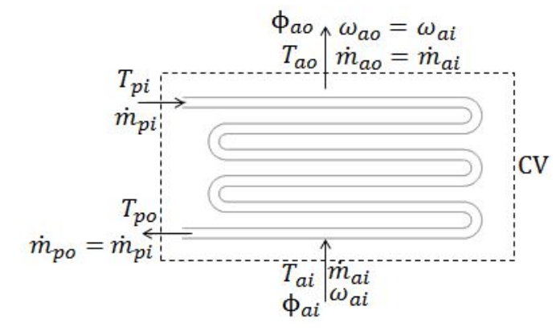
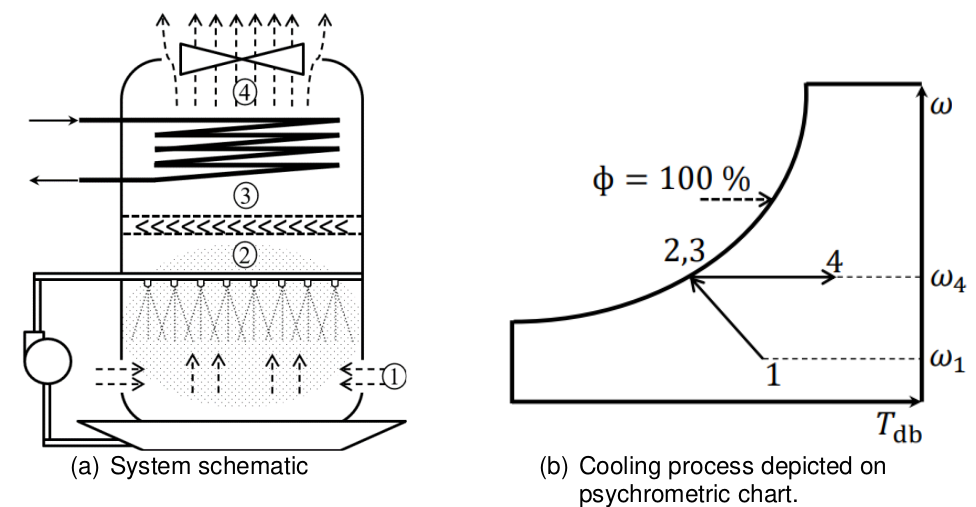

.. _dry_cooler_element:

==================
Dry Cooler
==================

.. seealso::
    :ref:`Unit Systems and Conventions <conventions>`

.. note::
    A dry cooler element should be associated to a :ref:`dry cooler controller <dry_cooler_controller>` 
    to map it to other prosumers elements

Create Function
=====================

.. autofunction:: pandaprosumer.create_controlled_dry_cooler

Input Parameters
=========================

*prosumer.dry_cooler*

Model
=================

The dry cooler model is based on a combination of the :ref:`heat demand controller <heat_demand_controller>`
and of the :ref:`heat_exchanger_controller <heat_exchanger_controller>`.

The dry cooler is a heat exchanger that uses air to cool down a fluid.

On the secondary side, the cooling demand is given from the input :math:`Q`, :math:`\dot{m}`, 
:math:`T_\text{feed}` and :math:`T_\text{return}` that may come from a timeseries data through a
:ref:`ConstProfile controller <const_profile_controller>`.

The ambient air temperature on the primary side is also an input that may be mapped from timeseries data.

    Schematic representation of an air-cooled heat exchanger (source: :cite:`Redelinghuys2023`)

The heat exchanger will then calculate the air flow rate needed to cool down the fluid to the desired temperature.
This air flow rate will be used to calculate the power consumption of the fans of the dry cooler, who are needed 
to apply a forced convection on the air and ensure cooling.
The power consumption of the fans is assumed to be proportional to the air flow rate.

The air mass flow rate is calculated similarly to the heat exchanger model based on the logarithmic mean temperature
difference (LMTD) calculation. However as known temperature is the cold input air temperature, the model is adapted.

The equation to solve is in this case:

.. math::
    :nowrap:

    \begin{align*}
        a * X - \ln{(1+X)} &= 0  \\
    \end{align*}

With

.. math::
    :nowrap:

    \begin{align*}
        a &= \Delta T_\text{cold} * \frac{Q_{r_n}}{Q_r} * \frac{1}{LMTD_n}  \\
        X &= \frac{\Delta T_\text{hot}}{\Delta T_\text{cold}} - 1
    \end{align*}

This equation is solved by dichotomy to find :math:`X`, then :math:`\Delta T_\text{hot}`,
then :math:`T_{\text{air}_\text{out}}`.

Assuming no heat losses, we then derive :math:`\dot{m}_\text{air}` given that

.. math::
    :nowrap:

    \begin{align*}
        Q_r = Q_\text{air} = Q_\text{water} = \dot{m}_\text{air} * Cp_\text{air} * \Delta T_\text{air} 
        = \dot{m}_\text{water} * Cp_\text{water} * \Delta T_\text{water}
    \end{align*}

.. note::
    :math:`a = 1` means that :math:`X = 0` so :math:`\Delta T_\text{hot} = \Delta T_\text{cold}`

    :math:`0 < a < 1` means that :math:`X > 0` so :math:`\Delta T_\text{hot} > \Delta T_\text{cold}`

    :math:`a > 1` means that :math:`-1 < X < 0` so :math:`\Delta T_\text{hot} < \Delta T_\text{cold}`

.. note::
    :math:`X < -1` would mean :math:`\Delta T_\text{hot} < 0`, so :math:`T_{2_\text{out}} > T_{1_\text{in}}`,
    which is not possible for the heat exchange

    :math:`a << 1` would mean :math:`\Delta T_\text{hot} >> \Delta T_\text{cold}`,
    so :math:`T_{2_\text{out}} < T_{2_\text{in}}` which is not possible for a countercurrent flows

The power consumption of the fans is then calculated from the "Fan Affinity Laws":

With impeller diameter :math:`D` constant, the power consumption of the fans is proportional to the cube of
the air flow rate, which is proportional to the shaft speed:

.. math::
    :nowrap:

    \begin{align*}
        \frac{Q_{\text{fan}_n}}{Q_{\text{fan}}} &= \left(\frac{\dot{m}_\text{air}}{\dot{m}_{\text{air}_n}}\right)  \\
        \frac{P_{\text{fan}_n}}{P_{\text{fan}}} &= \left(\frac{\dot{m}_\text{air}}{\dot{m}_{\text{air}_n}}\right)^3  \\
        P_\text{fan} &= \frac{P_{\text{fan}_n} * \dot{m}_\text{air}^3}{\dot{m}_{\text{air}_n}^3}  \\
    \end{align*}

    Schematic representation of an adiabatic cooler system and process (source: :cite:`Redelinghuys2023`)

The adiabatic feature consists in spraying water on the air to cool it down and increase the efficiency of the dry cooler.

For a given input air dry bulb temperature :math:`T_{db}` and relative humidity :math:`\phi`, the wet
bulb temperature :math:`T_{wb}` can be calculated using the formula from :cite:`Redelinghuys2023`:

.. math::
    :nowrap:

    \begin{align*}
        T_\text{wb} &= T_\text{db} * \arctan{(0.151977 * (\phi + 8.313659)^{0.5})} \\
        &+ \arctan{(T_{db} + \phi)} - \arctan{(\phi - 1.676331)} \\
        &+ 0.00391838 * \phi^{3/2} * \arctan{(0.023101 \phi)} - 4.686035  \\
    \end{align*}

with temperature in °C and in % as input arguments.

We assume that the air is saturated with water at the wet bulb temperature after going through the adiabatic 
pre-cooling system when it is activated, and that the air is then cooled down to this temperature.

Result Parameters
=========================
