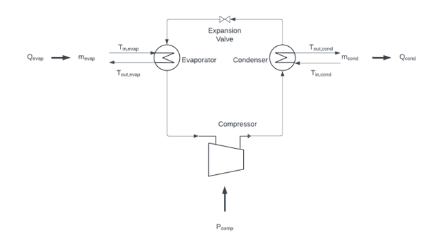

.. _heat_pump_element:

=============
Heat Pump
=============

.. seealso::
    :ref:`Unit Systems and Conventions <conventions>`

.. note::
    A heat pump element should be associated to a :ref:`heat pump controller <heat_pump_controller>` to map it to other prosumers elements

Create Function
=====================

.. autofunction:: pandaprosumer.create_controlled_heat_pump

Input Parameters
=========================

*prosumer.heat_pump*

Model
=================

The evaporator of the heat pump should get heat from a District Heating Network or from the ambient air.

The condenser should be connected to downstream elements in the prosumer or to a District Heating Network.

    Schematic representation of a thermal-based heat pump considered by EIFER during modeling (source: own creation)

To understand the thermal-based heat pump model developed by EIFER, it is first necessary to have an overview of the
technologies and parameters involved in the modelling of a heat pump.
Figure 4 offers a schematic representation of a thermal-based heat pump considered by EIFER during modelling.

The thermal-based heat pump modelled includes a compressor, a condenser, an expansion valve, and an evaporator.
In general terms, a heat pump requires a certain amount of power :math:`P_\text{comp}`, it transfers a certain
amount of heat :math:`Q_\text{cond}` to the heat sink, and it absorbs a certain amount of
heat :math:`Q_\text{evap}` from the heat source.

The thermal-based heat pump model developed by EIFER calculates the required heat pump mass flow on the
evaporator (:math:`\dot{m}_\text{evap}`) to produce enough heat (Qcond) to meet the requirements of the network
in terms of temperature increase (:math:`T_{\text{out}_\text{cond}} - T_{\text{in}_\text{cond}}`) with
a given mass flow (:math:`\dot{m}_\text{cond}`).

To do so, a series of parameters are required as a given input from the model developed:

* :math:`T_{\text{out}_\text{cond}}`: target temperature need from the network.
* :math:`T_{\text{in}_\text{cond}}`: return temperature from the network to the considered HP.
* :math:`\dot{m}_\text{cond}`: mass flow in the network, which for simplicity is considered water.
* :math:`T_{\text{in}_\text{evap}}`: temperature of the heat source at the inlet of the evaporator.
* :math:`\Delta T_\text{evap}`: it is the temperature difference between the inlet and outlet of the evaporator on the heat source side.
* :math:`Pinch`: it is a small temperature difference, usually in between 5-10 K, to account for
  temperature difference between the heat pump side and the heat source (or heat sink) side.
* :math:`\eta_\text{C}`: Carnot efficiency, usually between 0.4-0.6, used to simplify the calculation of the heat pump COP
* :math:`T_{\text{out}_{\text{cond}_\text{max}}}`: it is the maximum temperature that can be achieved at the outlet
  of the condenser on the heat sink side, it is usually given from the HP manufacturer and it depends on the refrigerant chosen.

Then, the calculation steps modelled follow the equations presented below:

1.	The first step is to calculate the condenser thermal demand :math:`Q_\text{cond}`, meaning the thermal need from the network

.. math::
    :nowrap:

    \begin{align*}
        Q_\text{cond} &= \dot{m}_\text{cond} * Cp_\text{cond} * (T_{\text{out}_\text{cond}} - T_{\text{in}_\text{cond}})  \\
    \end{align*}

Where :math:`Cp_\text{cond}` is the specific heat capacity at constant pressure of the fluid used in the heat network,
which is usually water

2. Then the temperature at the outlet of the evaporator is calculated (:math:`T_{\text{out}_\text{evap}}`)

.. math::
    :nowrap:

    \begin{align*}
        T_{\text{out}_\text{evap}} &= T_{\text{in}_\text{evap}} + \Delta T_\text{evap}  \\
    \end{align*}

3. Thanks to step n°2 it is possible to calculate the Carnot COP (:math:`COP_\text{C}`)

.. math::
    :nowrap:

    \begin{align*}
        COP_\text{C} &= \frac{T_{\text{out}_\text{cond}} + T_\text{pinch} + 273.15\text{K}}{T_{\text{out}_\text{cond}} - T_{\text{in}_\text{evap}}}  \\
    \end{align*}

4. Which allows a simplified calculation of the heat pump COP (:math:`COP_\text{HP}`)

.. math::
    :nowrap:

    \begin{align*}
        COP_\text{HP} &= \eta_\text{C} *  COP_\text{C} \\
    \end{align*}

5. The required electrical power :math:`P_\text{comp}` to provide :math:`Q_\text{cond}` is also calculated

.. math::
    :nowrap:

    \begin{align*}
        P_\text{comp} &= \frac{Q_\text{comp}}{COP_\text{HP}}  \\
    \end{align*}

6. From which it is possible to derive the heat required from the heat source :math:`Q_\text{evap}`

.. math::
    :nowrap:

    \begin{align*}
        Q_\text{evap} &= Q_\text{cond} - P_\text{comp}  \\
    \end{align*}

7. And finally the mass flow :math:`\dot{m}_\text{evap}` needed at the evaporator for the HP to provide the
   required :math:`Q_\text{cond}`
   Where :math:`Cp_\text{evap}` is the specific heat capacity at constant pressure of the fluid used in the heat sink

.. math::
    :nowrap:

    \begin{align*}
        \dot{m}_\text{evap} &= \frac{Q_\text{evap}}{Cp_\text{evap} * \Delta T_\text{evap}}  \\
    \end{align*}

8. It is important to check that the temperature at the outlet of the condenser is not above the maximum temperature
   achievable from the considered HP with the given refrigerant, otherwise that means that the maximum heat that can be
   provided to the network is lower than the requirement

.. math::
    :nowrap:

    \begin{align*}
        \text{if}\ T_{\text{out}_\text{cond}} > T_{\text{out}_{\text{cond}_\text{max}}}\
        \text{then}\ Q_\text{cond} &= \dot{m}_\text{cond} * Cp_\text{cond} * (T_{\text{out}_{\text{cond}_\text{max}}} - T_{\text{in}_\text{cond}})  \\
    \end{align*}

    The COP and power consumption are then recalculated based on the new :math:`Q_\text{cond}`.

9.  If the COP is higher than the maximum COP of the HP, the power consumption is set to the maximum power, 
    :math:`T_{\text{out}_\text{cond}}` is also recalculated based on the maximum COP.

10. If the power consumption is higher than the maximum power of the HP, :math:`\dot{m}_\text{cond}` is
    recalculated so that the power consumption is set to the maximum power.

.. math::
    :nowrap:

    \begin{align*}
        \text{if}\ P_\text{comp} > P_{\text{comp}_\text{max}}\
        \text{then}\ \dot{m}_\text{cond} &= \frac{P_{\text{comp}_\text{max}} * COP_\text{HP}}{Cp_\text{cond} * (T_{\text{out}_\text{cond}} - T_{\text{in}_\text{cond}})}  \\
    \end{align*}

11.  If the power consumption is lower than the minimum power of the HP, the heat pump is considered off and
     the power consumption is set to zero,

.. note::
    **Limitations of the model:**

    * Assume a constant :math:`\Delta T_\text{evap}`

    * Assume a constant :math:`\eta_\text{C}`

Result Parameters
=========================

Tutorial
=========================
.. toctree::
   :maxdepth: 2
   :caption: Tutorial:

   ../tutorials/heat_pump_model.ipynb